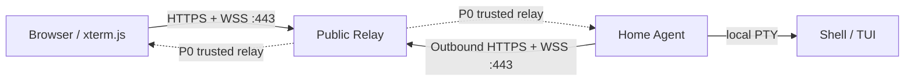

# Remote Terminal 产品需求文档

| 字段 | 内容 |
| --- | --- |
| 文档状态 | v1.0，实施基线 |
| 日期 | 2026-08-04 |
| 产品形态 | 自托管 Web 应用 + 公网中继 + 设备 Agent |
| 首要用户 | 需要从外网访问家中电脑终端的个人用户 |
| 首发平台 | Linux 设备与桌面端现代浏览器 |
| 后续平台 | macOS、Windows、平板与手机 |

本文使用“必须”“应该”“可以”表达 RFC 2119 语义。功能优先级如下：

- **P0**：首个可安全日常使用的版本，不满足即不可发布。
- **P1**：完整产品版本，P0 架构必须为其保留清晰演进路径。
- **P2**：高级能力，按独立功能开关交付。
- **候选**：已识别但不进入当前承诺范围，进入前必须单独评审安全、复杂度与依赖成熟度。

---

## 1. 产品摘要

Remote Terminal 让用户在家中电脑没有公网 IP、没有路由器端口映射的情况下，从任意受支持浏览器安全访问该电脑的真实 Shell。

家中电脑运行低权限 Agent。Agent 只主动建立到用户自有公网服务器的 WSS 出站隧道；浏览器同样只连接公网中继。中继完成用户认证、设备授权和双向字节转发，不要求家庭网络开放任何入站端口。Shell 与 PTY 始终运行在家中设备，浏览器只负责终端仿真与交互，中继不替代 Shell。

首发版本采用**可信中继模型**：浏览器到中继、Agent 到中继均使用 TLS，但中继进程在转发时能够看到终端明文。P2 提供应用层端到端加密时，中继才变为不可读内容的盲转发节点。产品必须明确展示当前会话使用的安全模式，不能把链路 TLS 宣称为端到端加密。

## 2. 问题与机会

### 2.1 用户问题

1. 家庭宽带通常没有可用公网 IPv4，IPv6 暴露、DDNS、端口映射和防火墙配置复杂且容易留下攻击面。
2. 传统 SSH 需要本地客户端、密钥管理和可达网络，不适合临时使用陌生电脑或平板浏览器。
3. 简单的“WebSocket 转发 Shell”工具通常缺少安全配对、断线恢复、会话生命周期、流控、审计与现代终端体验。
4. 自建用户希望数据、设备身份和访问入口由自己控制，不依赖第三方终端共享服务。

### 2.2 产品机会

用一个单一公网入口完成身份认证和中继，把网络穿透问题转换为两个标准 HTTPS/WSS 出站连接；同时复用 xterm.js、PTY、tmux、WebAuthn 等成熟实现，把自研范围收敛到授权、会话协调、可恢复转发和产品体验。

## 3. 目标、原则与非目标

### 3.1 产品目标

1. **零家庭入站端口**：仅允许 Agent 主动访问公网中继的 443 端口。
2. **真实终端兼容性**：bash、zsh、fish、PowerShell、vim、neovim、tmux、htop 和基于 curses/TUI 的程序能正确运行。
3. **安全默认值**：强认证、短时票据、最小权限、内容不落盘、危险粘贴保护和可撤销设备身份默认开启。
4. **会话与连接解耦**：浏览器断开不结束 Shell；同一会话可以重新附着。
5. **低延迟与有界资源**：终端输出不进入 React 渲染链路；所有网络队列、日志、滚动缓冲和图像缓存都有上限。
6. **自托管可运维**：单机部署、备份、升级、健康检查和安全事件查询清晰可执行。
7. **成熟库优先**：不自研终端仿真、PTY、密码算法、通行密钥、UI 无障碍原语、虚拟列表或数据库驱动。
8. **架构一致**：前后端使用生成的协议类型；Rust 用领域类型和参数对象表达约束，不以大量自由函数或长参数列表组织业务。

### 3.2 产品原则

- **终端内容是最高敏感数据**：它可能包含密码、令牌、源码和个人文件。
- **控制权限显式且唯一**：一个会话同一时刻只有一个控制者；其他附着默认是观察者。
- **断开不等于退出，关闭必须区分**：关闭浏览器标签页、分离会话、向 Shell 发送 EOF、终止进程是四种不同动作。
- **终端输出不可信**：标题、链接、OSC 序列、文件名和自定义解析结果都不能直接进入 HTML。
- **失败必须可解释**：设备离线、认证过期、协议不兼容、输出缺口、Shell 退出和中继故障使用不同状态与错误码。
- **能力渐进增强**：WebGL、图像、剪贴板、通知和持久终端内容均有安全回退路径。

### 3.3 非目标

- P0 不提供远程桌面、VPN、通用内网穿透、Kubernetes 管理、串口控制或完整 Web IDE。
- P0 不把 Agent 作为 root/Administrator 系统服务运行，也不绕过操作系统权限。
- P0 不替代 SSH、tmux 或用户 Shell 的历史记录机制。
- P0 不解析、理解或审计用户命令内容。
- P0 不提供匿名公开终端、永久分享链接、广告、第三方运行时代码、外部 CDN 脚本或外部字体。
- P0 不承诺设备重启后恢复直接 PTY 进程；POSIX 持久进程由 P1 的 tmux 配置承担。
- 不自研终端转义序列解释器、密码学原语或专用浏览器渲染器。

## 4. 用户与核心场景

### 4.1 用户角色

| 角色 | 说明 | 权限 |
| --- | --- | --- |
| 所有者 | 部署中继、登录网页并配对设备的个人用户 | 管理设备、会话、凭据、策略与审计事件 |
| 控制者 | 当前持有某会话输入租约的附着 | 输入、粘贴、调整 PTY 尺寸、发送信号 |
| 观察者 | 只读附着 | 查看实时输出与公开的会话状态 |
| 受邀者 | P2 中通过短时邀请进入的外部用户 | 默认仅观察；控制权必须由所有者逐次授予 |

P0 可以只允许一个所有者，但数据模型和授权检查不能把“全局唯一用户”写死到会话与设备逻辑中。

### 4.2 关键使用场景

1. **首次部署**：用户在公网服务器部署中继，通过一次性引导链接注册首个通行密钥并下载恢复码。
2. **设备配对**：用户在家中电脑启动 Agent 的 OAuth 2.0 Device Authorization Grant，随后在已登录网页核对并授权一次性用户码；设备随后只使用出站 WSS 自动上线。
3. **外网开终端**：用户在外登录网页，选择在线设备与 Shell 配置，2 秒内看到可输入的终端。
4. **网络漫游**：手机热点切换或笔记本休眠后，浏览器自动重新认证附着并从最后确认的输出偏移继续。
5. **后台长任务**：用户分离网页，Shell 继续运行；稍后重新附着并看到仍可恢复的输出。
6. **多终端工作**：用户用标签页和分屏同时运行编辑器、日志和监控工具，布局在刷新后恢复。
7. **设备离线**：网页准确展示最后在线时间、离线原因分类和重试状态，不创建假会话。
8. **安全处置**：用户撤销丢失设备或浏览器会话；现有连接立即失效并写入审计事件。

## 5. 系统边界与信任模型

### 5.1 系统模块

| 模块 | 部署位置 | 职责 | 不负责 |
| --- | --- | --- | --- |
| Web | 浏览器 | UI、xterm.js 仿真、输入、布局、本地无敏感偏好状态 | 启动 Shell、持有设备长期密钥 |
| Relay | 公网服务器 | 用户认证、设备配对、在线状态、短时票据、会话协调、字节转发、审计元数据 | 解释终端控制序列、模拟 Shell |
| Agent | 家中设备 | 主动连中继、启动 PTY/Shell、维护会话与有界输出日志、执行文件传输 | 接受公网入站连接、提升用户权限 |
| PTY | 家中设备操作系统 | 真实终端设备语义、窗口尺寸、进程输入输出 | 网络、浏览器渲染 |
| Shell | 家中设备用户空间 | 命令解析、历史记录、补全、作业控制 | 远程认证、网页布局 |

### 5.2 网络拓扑



硬性约束：

- 家庭路由器不需要端口映射、UPnP、IPv6 入站规则或公网 IP。
- 浏览器与 Agent 都只信任配置的中继源站；生产环境不允许明文 HTTP/WS。
- Agent 维持一条控制 WSS；每个运行中的会话按需建立独立数据 WSS。P0 不在单条 WebSocket 上自研通用多路复用协议。
- 中继使用一次性、短时会话票据把浏览器数据连接与 Agent 数据连接配对。
- WebSocket 是可靠有序传输，但应用仍需要输出偏移、确认和缺口事件来支持断线重连与有界缓存。

### 5.3 信任声明

| 模式 | 链路保护 | 中继能否读取终端内容 | 版本 |
| --- | --- | --- | --- |
| 可信中继 | 浏览器—中继 TLS；Agent—中继 TLS | 能 | P0 |
| 端到端加密 | TLS + 浏览器—Agent 应用层会话密钥 | 不能；仍能看到设备、会话、流量大小和时间元数据 | P2 |

端到端加密必须采用经过审查的跨语言协议与实现，包含设备密钥验证、前向保密、重放保护、密钥轮换和多附着密钥分发；任一条件未满足时不得显示“端到端加密”。
机密会话必须关闭 Relay 侧内容录制、内容解析和 `permessage-deflate`。Shell Integration 若完全在浏览器端解析解密后的 OSC 数据仍可使用；Agent 侧录制只有在用户明确开启且独立加密时才允许。

## 6. 领域对象与状态

术语的规范定义见根目录 `CONTEXT.md`。

### 6.1 核心对象

| 对象 | 稳定身份 | 所有者 | 持久位置 |
| --- | --- | --- | --- |
| User | `UserId` | Relay | SQLite |
| Device | `DeviceId` | User | Relay 元数据；Agent 持有设备凭据 |
| Profile | `ProfileId`，作用域为 Device | Device | Agent 配置；Relay 只缓存可展示元数据 |
| Session | `SessionId` | User + Device | 生命周期元数据在 Relay；进程和 PTY 在 Agent |
| Attachment | `AttachId` | User/Invite | 内存态，必要元数据写审计 |
| Transfer | `TransferId` | User + Device | P1 仅持久化元数据，不持久化内容 |
| Recording | `RecordingId` | User + Session | P2，经明确开启后加密存储 |
| Audit Event | `EventId` | User | Relay SQLite |

所有 ID 使用不可猜测、可排序的 UUIDv7，并在 Rust/TypeScript 中使用不同类型，不能用裸字符串互换。

### 6.2 状态机

**设备**：`Online → Degraded → Offline`；任一有效状态可进入 `Revoked`，撤销后不能自动恢复。

**会话**：`Starting → Running → Exited`。设备或 Agent 异常丢失时为 `Lost`；重新获得同一 Agent 内存态会话后可从 `Lost` 回到 `Running`。`Detached` 不是会话状态，而是“当前无附着”。

**附着**：`Connecting → Attached → Suspended → Attached`，最终进入 `Closed`。网络中断进入 `Suspended`，不会触发 Session 退出。

**传输**：`Queued → Running → Verifying → Done`，失败进入 `Failed`，用户取消进入 `Canceled`。

## 7. 完整功能清单

### 7.1 身份、部署与设备

| ID | 优先级 | 功能 | 验收行为 |
| --- | --- | --- | --- |
| ID-001 | P0 | 首个管理员引导 | 只能通过服务器本地生成的单次、短时 URL 创建首个用户；使用后立即失效 |
| ID-002 | P0 | 通行密钥登录 | WebAuthn 为首选登录方式；支持多个通行密钥、命名、查看最近使用和撤销 |
| ID-003 | P0 | 恢复码 | 首次注册生成一次性恢复码；服务器只存哈希；使用一个立即失效 |
| ID-004 | P0 | 浏览器会话 | 使用 `HttpOnly`、`Secure`、`SameSite=Strict` Cookie；支持查看与撤销其他登录会话 |
| ID-005 | P1 | OIDC | 可连接自托管 OIDC；本地通行密钥保留为紧急入口，不能被远端配置静默禁用 |
| DEV-001 | P0 | 标准设备配对 | 按 RFC 8628 使用高熵 `device_code`、短 `user_code`、验证 URI、10 分钟过期、轮询间隔和一次性消费；授权页必须让已登录用户核对设备名与指纹 |
| DEV-002 | P0 | 设备凭据 | Agent 获得至少 256 位随机凭据，保存在 OS keyring；服务器只保留不可逆校验材料 |
| DEV-003 | P0 | 主动出站隧道 | Agent 仅连接 `https/wss` 中继 443，无任何监听公网端口 |
| DEV-004 | P0 | 设备列表 | 展示名称、平台、Agent 版本、在线状态、延迟、最后在线时间和协议兼容性 |
| DEV-005 | P0 | 设备管理 | 重命名、查看详情、轮换凭据、撤销；撤销立即关闭控制和数据连接 |
| DEV-006 | P0 | 心跳与退避 | 心跳能区分在线、退化、离线；重连使用指数退避和抖动，不能形成重连风暴 |
| DEV-007 | P1 | 多设备 | 一个用户可配对多台设备并按最近使用、状态、名称筛选 |
| DEV-008 | P1 | Agent 更新提示 | 只报告版本与兼容性；自动更新必须校验签名且默认关闭 |
| DEV-009 | P2 | 设备分组与标签 | 标签支持筛选和授权，不改变设备身份 |

### 7.2 Shell 与 PTY

| ID | 优先级 | 功能 | 验收行为 |
| --- | --- | --- | --- |
| PTY-001 | P0 | 原生 PTY | Linux 使用真实 PTY；macOS 使用原生 PTY；Windows 后续使用 ConPTY，不能用普通管道冒充终端 |
| PTY-002 | P0 | Shell 配置 | Agent 本地声明 Shell 可执行文件、参数、初始目录、允许的环境变量和终端类型；浏览器只传 `ProfileId` |
| PTY-003 | P0 | 默认 Shell 发现 | Agent 能发现当前用户默认 Shell，但首次展示前必须给出解析结果，不静默回退到高权限 Shell |
| PTY-004 | P0 | 尺寸同步 | 控制者的列、行、像素尺寸经防抖后更新 PTY；TUI 收到正确 resize 事件 |
| PTY-005 | P0 | 作业控制 | Ctrl+C、Ctrl+D、Ctrl+Z、信号与前后台作业行为由 PTY/Shell 正确处理 |
| PTY-006 | P0 | 退出状态 | 正常退出、信号终止、Agent 丢失和用户强制终止显示不同原因与退出码 |
| PTY-007 | P0 | UTF-8 环境 | 首发只承诺 UTF-8；Profile 必须确保合理的 `TERM` 与 locale，默认 `TERM=xterm-256color` |
| PTY-008 | P1 | tmux 持久会话 | POSIX Profile 可选择 tmux；Agent 重启或浏览器重新附着时由 tmux 重绘当前屏幕 |
| PTY-009 | P1 | 自定义初始目录 | 目录必须存在且对 Agent 用户可访问；错误时返回类型化原因，不自动改到 `/` |
| PTY-010 | P2 | SSH Profile | Agent 可作为 SSH 客户端连接内网目标；密钥只留在 Agent，浏览器和 Relay 不接收私钥 |
| PTY-011 | 候选 | 容器/命名空间 Profile | 通过明确的现成运行时适配器启动，不能把任意命令拼接为 Shell 字符串 |

### 7.3 终端仿真与显示

终端仿真统一采用 `@xterm/xterm`，以 6.0.0 的稳定能力为 PRD 基线并由 lockfile 固定实际版本。任何上游尚未支持的控制序列优先贡献上游或等待官方插件，不在产品内另写第二套仿真器。

| ID | 优先级 | 功能 | 验收行为 |
| --- | --- | --- | --- |
| TERM-001 | P0 | VT/ANSI/xterm 兼容 | 光标、清屏、滚动区、备用屏、SGR、DEC 模式与常见 TUI 正常工作 |
| TERM-002 | P0 | 色彩 | 16 色、256 色、24 位真彩、粗体、斜体、下划线、反色、暗色和删除线按主题约束显示 |
| TERM-003 | P0 | Unicode | CJK 宽字符、组合字符、emoji 和 IME 可输入显示；字符宽度由 xterm Unicode 插件控制 |
| TERM-004 | P0 | 光标 | 块、下划线、竖线、闪烁开关与应用请求的光标样式可见 |
| TERM-005 | P0 | 备用屏 | vim、less、tmux 等进入退出备用屏后主缓冲内容正确恢复 |
| TERM-006 | P0 | 鼠标协议 | 点击、拖动、滚轮和修饰键能传递给声明鼠标模式的 TUI；按住平台选择键可强制文本选择 |
| TERM-007 | P0 | 焦点与粘贴协议 | 支持焦点报告与 bracketed paste；粘贴不被错误拆成逐键输入 |
| TERM-008 | P0 | OSC 标题 | 会话标题可跟随终端请求，但必须做长度限制、文本转义并允许用户锁定自定义名称 |
| TERM-009 | P0 | 超链接 | 支持 OSC 8 与纯文本 `http/https` 链接；打开前执行协议白名单和外部跳转提示 |
| TERM-010 | P0 | WebGL | 可用时使用官方 WebGL2 插件；上下文丢失、节能或不支持时自动回退默认渲染器 |
| TERM-011 | P0 | 自适应尺寸 | 使用官方 Fit 插件；容器、字体、缩放、分屏改变时重新计算，不形成 ResizeObserver 循环 |
| TERM-012 | P0 | 滚动缓冲 | 默认 10,000 行，可配置 1,000–100,000；UI 展示内存风险，不能无限增长 |
| TERM-013 | P0 | 主题与字体 | 内置深色、浅色、高对比主题；支持自托管等宽字体、字号、行高、字距和不透明度 |
| TERM-014 | P0 | Bell | 视觉 Bell 默认开启，声音默认关闭；浏览器未授权时不重复请求权限 |
| TERM-015 | P1 | 字素簇 | 官方 grapheme 插件稳定性允许时以功能开关启用；异常时可退回 Unicode 11 宽度 |
| TERM-016 | P1 | 连字 | 官方 ligatures 插件按字体能力可选开启；默认关闭以避免代码字符歧义和额外开销 |
| TERM-017 | P1 | 进度协议 | 支持 OSC 9;4，在标签页和任务状态中显示进度，所有值做范围限制 |
| TERM-018 | P2 | 内联图像 | 使用官方 image 插件支持 SIXEL、iTerm IIP 与其已实现的 Kitty 子集；默认关闭并严格限制像素、负载和缓存 |
| TERM-019 | P0 | Kitty 键盘协议 | 启用 xterm.js 已支持的 CSI u 渐进增强，使现代 TUI 能区分修饰键；不以私有解析器扩展上游未支持部分 |
| TERM-020 | P0 | 同步输出 | 使用 xterm.js 6.0.0 对 DECSET 2026 的内建支持，批量提交高频屏幕更新，避免可见撕裂 |
| TERM-021 | P2 | HTML/文本导出 | 使用 Serialize 插件导出选择区或缓冲区；导出前显示可能含敏感信息的提示 |
| TERM-022 | 不支持 | 旧编码与完整 RTL | V1 不承诺非 UTF-8 编码、完整双向文本排版、Tektronix/ReGIS 仿真 |

### 7.4 键盘、选择、搜索与剪贴板

| ID | 优先级 | 功能 | 验收行为 |
| --- | --- | --- | --- |
| IO-001 | P0 | 完整键盘输入 | 功能键、方向键、Home/End、Insert/Delete、Ctrl/Alt/Meta/Shift 组合与数字键盘可用 |
| IO-002 | P0 | IME | 中文、日文等合成输入不被快捷键层截断；输入法 composing 期间不发送半成品 |
| IO-003 | P0 | 选择 | 字符、单词、整行选择，拖动自动滚屏，双击/三击行为符合桌面习惯 |
| IO-004 | P0 | 复制 | `Ctrl/Cmd+Shift+C` 与上下文菜单复制；有选择时平台复制键不发送 SIGINT |
| IO-005 | P0 | 粘贴防护 | 多行、超过阈值或含控制字符的粘贴先显示可审阅预览；用户可按会话临时关闭，不能全局默认关闭 |
| IO-006 | P0 | 剪贴板策略 | 网页只能在用户手势下读写剪贴板；OSC 52 默认拒绝，用户可对当前会话单次允许写入 |
| IO-007 | P0 | 搜索 | 支持正向/反向、大小写、全词和正则搜索，显示当前与总匹配数并高亮 |
| IO-008 | P0 | 字号缩放 | 快捷键与菜单缩放后保持 PTY 尺寸同步和可读滚动位置 |
| IO-009 | P0 | 快捷键映射 | 提供平台默认映射、冲突检测、恢复默认；浏览器保留键需明确标记为不可覆盖 |
| IO-010 | P1 | 命令导航 | Shell 集成可用时按命令标记跳到上一/下一命令及其输出 |
| IO-011 | P1 | 触控工具栏 | 手机和平板提供 Esc、Tab、Ctrl、Alt、方向键、PageUp/PageDown 和可固定组合键 |
| IO-012 | P2 | 广播输入 | 可向选定会话广播；进入时二次确认、常驻危险标识、粘贴再次确认、一键停止 |

### 7.5 会话、标签页、分屏与工作区

| ID | 优先级 | 功能 | 验收行为 |
| --- | --- | --- | --- |
| SES-001 | P0 | 创建会话 | 选择在线设备与 Profile 后创建；重复提交使用幂等键，不产生重复 Shell |
| SES-002 | P0 | 标签页 | 新建、切换、重命名、重排、复制会话入口、关闭；未退出会话关闭时明确选择分离或终止 |
| SES-003 | P0 | 分屏 | 水平/垂直拆分、拖动比例、聚焦、放大单 pane、关闭 pane；使用成熟 resizable panels 库 |
| SES-004 | P0 | 分离与重附着 | 分离只关闭 Attachment；Session 与 PTY 继续运行；会话列表可重新附着 |
| SES-005 | P0 | 终止会话 | 先请求 Shell 正常退出，超时后允许显式强制终止；展示受影响进程与不可恢复说明 |
| SES-006 | P0 | 唯一控制者 | 只有控制者能输入和 resize；观察者视图不能产生隐式尺寸竞争 |
| SES-007 | P0 | 会话状态 | 展示设备、Profile、运行时长、连接状态、控制角色、尺寸、退出码和可恢复输出范围 |
| SES-008 | P0 | 刷新恢复布局 | 标签、分屏、比例、名称和活动项恢复；凭据、未确认输入和终端内容默认不落浏览器持久存储 |
| SES-009 | P0 | 命令面板 | 新建、切换、分屏、搜索、主题、重连、分离和终止可通过 `cmdk` 命令面板调用 |
| SES-010 | P1 | 工作区 | 用户可保存多套设备、会话入口、布局和主题组合；恢复时离线项显示占位状态 |
| SES-011 | P1 | 会话模板 | 保存 Profile、初始目录、标签颜色与布局，不保存命令输入或明文密钥 |
| SES-012 | P1 | 弹出窗口 | 单个 pane 可移到独立浏览器窗口；控制租约随活动附着转移，不产生双控制者 |
| SES-013 | P1 | 活动与未读 | 后台会话有输出、Bell、退出和长任务完成时显示未读标记，可单独静音 |
| SES-014 | P2 | 多工作区同步 | 无敏感布局偏好可同步到 Relay；终端屏幕内容仍默认不上传存储 |

### 7.6 网络、流控与恢复

| ID | 优先级 | 功能 | 验收行为 |
| --- | --- | --- | --- |
| NET-001 | P0 | WSS 双向转发 | 输入输出使用二进制帧和生成的 Protobuf 信封；禁止生产环境 WS 明文降级 |
| NET-002 | P0 | 输出顺序 | Agent 为每个 Session 维护单调递增字节偏移；客户端按序写入 xterm，不重复、不乱序 |
| NET-003 | P0 | 有界输出日志 | Agent 默认每会话保留 8 MiB 内存日志，可配置 1–64 MiB；永不默认落盘 |
| NET-004 | P0 | 断线续传 | Attachment 用最后确认偏移恢复；日志仍覆盖该偏移时只补发缺失数据 |
| NET-005 | P0 | 输出缺口 | 偏移已被淘汰时发送明确 `Gap`，重置浏览器缓冲并解释可能缺失的历史，不伪装为完整恢复 |
| NET-006 | P0 | 反压 | Attachment 的 ACK 窗口由 xterm `write` 回调推进，高水位时暂停该 Attachment 对应的上游读取；慢消费者独立暂停或断开。无 Attachment 时 Journal 作为滚动日志淘汰最旧输出，让后台任务继续并保留 `Gap` 语义 |
| NET-007 | P0 | 心跳 | 控制连接和 Attachment 都检测半开连接；代理超时与设备离线分开显示 |
| NET-008 | P0 | 自动重连 | 临时异常按指数退避重试；认证、撤销、协议不兼容和明确退出不自动无限重试 |
| NET-009 | P0 | 网络质量 | 状态栏显示 RTT 分级、重连次数和当前恢复状态，不展示虚构带宽 |
| NET-010 | P0 | 协议协商 | Hello 包含协议版本、Agent 版本、平台和能力位；不兼容时拒绝有解释的连接 |
| NET-011 | P0 | 消息限制 | 控制消息、终端块、标题、错误和图像均有独立最大尺寸；超限关闭相关流并写安全事件 |
| NET-012 | P1 | 压缩策略 | 终端小包默认不启用 WebSocket 压缩；大文本块经基准证明收益后才按连接协商，避免压缩敏感交互数据 |
| NET-013 | 不采用 | WebRTC DataChannel | 本拓扑的双方都已连接公网 Relay；WebRTC 仍需 ICE/STUN/TURN 且不能提供浏览器到 Agent 的天然 E2EE，收益不足以抵消复杂度 |
| NET-014 | P2 | 端到端加密 | 内容帧加密、身份验证、前向保密、重放保护和多附着密钥轮换全部通过互操作测试后交付 |
| NET-015 | 候选 | WebTransport/HTTP3 | 在受支持浏览器中评估原生流控与多流；必须保留 WSS 和 TCP/443 回退，不能要求家庭网络开放 UDP |

### 7.7 生产力能力

| ID | 优先级 | 功能 | 验收行为 |
| --- | --- | --- | --- |
| PROD-001 | P0 | 会话内查找 | 搜索只读取 xterm 缓冲，不向 Relay 上传查询或缓冲内容 |
| PROD-002 | P0 | 快速切换 | 可按设备、会话名和状态模糊搜索，列表键盘可达 |
| PROD-003 | P1 | Shell 集成 | 采用常见 OSC Shell Integration 标记识别命令边界、工作目录、退出码和任务状态；失败时终端仍完全可用 |
| PROD-004 | P1 | 片段 | 用户保存命令片段、变量和说明；执行前始终进入可编辑预览，不自动发送 |
| PROD-005 | P1 | 路径与错误链接 | 可识别文件路径和 `file:line:column`；只通过明确的文件查看器处理，不构造任意 URL |
| PROD-006 | P1 | 长任务通知 | 标签页后台且命令超过阈值时，在获得浏览器授权后通知完成/失败；内容默认不含命令文本 |
| PROD-007 | P1 | 导出 | 选择区可导出纯文本/HTML；完整会话导出需显式确认并标记敏感数据 |
| PROD-008 | P2 | 终端录制回放 | Agent 侧捕获 PTY 原始字节与时间戳，写为 asciinema v2 兼容格式并使用现成播放器；默认关闭、显示录制指示、可设保留期 |
| PROD-009 | 候选 | AI 辅助 | 仅允许解释或生成待审阅文本，绝不自动执行；必须支持本地/自托管模型并明确数据去向 |

Shell 历史、补全、别名、提示符、目录栈和作业控制属于用户 Shell，不在 Web 层复制一套状态。

### 7.8 文件传输

| ID | 优先级 | 功能 | 验收行为 |
| --- | --- | --- | --- |
| FILE-001 | P1 | 上传 | 浏览器选择文件和目标路径，显示大小、覆盖冲突与进度；临时文件校验成功后原子改名 |
| FILE-002 | P1 | 下载 | Agent 以自身用户权限打开明确路径，流式传输，不把完整文件载入内存或 Relay 磁盘 |
| FILE-003 | P1 | 续传 | 使用偏移与 BLAKE3 校验；网络恢复后从已确认块继续，完成前不能报告成功 |
| FILE-004 | P1 | 取消与限额 | 用户可取消；并发数、单文件大小、队列、块和速率可配置且有安全默认值 |
| FILE-005 | P1 | 覆盖保护 | 默认不覆盖；覆盖必须明确确认；P1 不提供远程删除，避免把文件管理器范围混入首版 |
| FILE-006 | P1 | 隐私 | Relay 只转发字节并记录元数据；默认不存文件名全文到普通运行日志 |
| FILE-007 | P2 | 目录浏览 | 分页、虚拟化、面包屑、隐藏文件开关和类型化权限错误；不跟随越权符号链接 |
| FILE-008 | P2 | 拖放上传 | 拖入终端时先显示目标目录和文件清单，不把本地路径文本直接粘贴进 Shell |

不使用 base64/OSC 将大文件塞入终端输出；文件流与终端流分离，拥有独立票据、限额和审计事件。

### 7.9 协作、分享与控制权

| ID | 优先级 | 功能 | 验收行为 |
| --- | --- | --- | --- |
| COL-001 | P2 | 短时邀请 | 邀请默认只读、单会话、单次使用、最长 24 小时，可随时撤销 |
| COL-002 | P2 | 观察者 | 能看实时输出，但不能输入、resize、读写剪贴板、传文件或查看设备其他信息 |
| COL-003 | P2 | 请求控制 | 受邀者请求后由所有者逐次授予；控制租约有明显状态、超时和一键收回 |
| COL-004 | P2 | 多人光标状态 | 显示参与者和控制者，不把终端字符网格改造成多人编辑器 |
| COL-005 | P2 | 分享审计 | 邀请创建、加入、授予/收回控制、过期和撤销均写审计事件 |
| COL-006 | P2 | 内容隔离 | 分享会话不能访问其他标签、文件、片段、设置或历史元数据 |

### 7.10 录制与审计

| ID | 优先级 | 功能 | 验收行为 |
| --- | --- | --- | --- |
| AUD-001 | P0 | 安全审计 | 登录、失败登录、凭据变更、配对、撤销、会话创建/结束、强制终止和配置变更有结构化事件 |
| AUD-002 | P0 | 内容最小化 | 审计默认不含命令、输入、输出、环境变量、剪贴板或文件内容 |
| AUD-003 | P0 | 查询与导出 | 所有者可按时间、类型、设备、结果筛选和导出 JSON；长列表使用虚拟化 |
| AUD-004 | P0 | 防篡改线索 | 事件包含单调序列、前一事件摘要和服务器时间；这提供篡改可见性，不宣称外部不可抵赖 |
| AUD-005 | P1 | 保留策略 | 可配置保留天数和最大条数；清理本身生成审计事件 |
| REC-001 | P2 | 明示录制 | 每次会话单独开启，终端内常驻指示，参与者进入时再次告知 |
| REC-002 | P2 | 加密与保留 | 录制加密存储，支持自动过期、手动删除与导出；密钥不写普通配置或日志 |
| REC-003 | P2 | 输入策略 | 可选择仅输出或输入输出；密码模式无法可靠检测，UI 必须明确告知录制可能捕获秘密 |

### 7.11 设置、可访问性与国际化

| ID | 优先级 | 功能 | 验收行为 |
| --- | --- | --- | --- |
| UX-001 | P0 | 外观 | 系统/深色/浅色/高对比，终端主题与应用主题可独立配置 |
| UX-002 | P0 | 响应式桌面 | 1280×720 起完整支持；小宽度下设备栏折叠，终端不产生页面级横向滚动 |
| UX-003 | P0 | 键盘可达 | 登录、设备、标签、分屏、对话框、菜单、搜索和设置均可不用鼠标完成 |
| UX-004 | P0 | 焦点管理 | Radix 对话框/菜单关闭后焦点回到触发元素；终端聚焦状态有视觉提示 |
| UX-005 | P0 | 屏幕阅读器 | 提供 xterm.js screen reader 模式和无障碍标签；高输出时提示性能取舍 |
| UX-006 | P0 | 动效偏好 | 遵循 `prefers-reduced-motion`；重连、Bell 和通知不依赖动画单独传达 |
| UX-007 | P0 | 文案与错误 | 首发提供简体中文和英文；错误包含发生位置、影响、是否重试和下一动作 |
| UX-008 | P1 | 移动端 | 触控选择、软键盘工具栏、全屏单 pane 和安全粘贴；移动端不承诺多分屏 |
| UX-009 | P1 | 设置同步 | 主题、键位、布局模板可同步；敏感终端内容和设备凭据不可同步 |
| UX-010 | P1 | 本地备份 | 用户可导入导出无敏感偏好设置，格式带版本并验证后应用 |

## 8. 关键用户流程

### 8.1 首次引导

1. 管理员在 Relay 主机本地运行引导命令，得到 10 分钟有效 URL。
2. 浏览器访问 HTTPS URL，检查源站后注册首个 WebAuthn 通行密钥。
3. 系统展示一次性恢复码；用户确认已保存后才完成初始化。
4. Relay 禁用引导端点，并进入空设备页。
5. 空状态提供按 Linux/macOS/Windows 分类的签名 Agent 安装与配对指令。

### 8.2 设备配对

1. 用户在家中电脑运行 Agent `pair <relay-url>` 并核对 HTTPS Relay URL。
2. Agent 请求 RFC 8628 Device Authorization，得到高熵 `device_code`、短 `user_code`、`verification_uri`、过期时间和轮询间隔。
3. 用户在已登录浏览器打开验证 URI，输入用户码，核对设备名、平台与短指纹后授权。
4. Agent 按服务器间隔轮询 token 端点；Relay 原子消费授权并签发至少 256 位设备凭据。
5. Agent 将凭据存入 OS keyring，建立控制 WSS 并上传可用 Profile 元数据；网页状态变为 Online。
6. 配对请求、用户授权、凭据签发和首次上线分别写入审计事件。

### 8.3 创建终端

1. 用户选择 Device、Profile、初始目录和终端尺寸，提交带幂等键的创建请求。
2. Relay 鉴权后向 Agent 控制连接发送 `Open`，同时签发一次性 Agent 数据票据。
3. Agent 验证 Profile，创建 PTY 和 Shell，建立该 Session 的数据 WSS。
4. Agent 返回 `Ready`、实际 Profile、PID 元数据、初始尺寸和输出起始偏移。
5. Relay 向浏览器签发 Attachment 票据；浏览器打开 WSS 并挂载 xterm.js。
6. 浏览器首屏可输入后记录打开耗时；任何失败返回稳定错误码并清理半开资源。

### 8.4 断线恢复

1. 浏览器检测连接异常，将 Attachment 标记为 Suspended，终端保留可见但禁止盲输。
2. Relay Session 仍存在；Agent 继续读取 PTY 并写入有界 Journal。
3. 浏览器重新获取短时 Attachment 票据，并携带最后确认输出偏移。
4. Agent 若仍持有该偏移，则补发缺失块并发送 `CaughtUp`；浏览器恢复输入。
5. 若 Journal 已淘汰该偏移，则发送 `Gap`。浏览器清屏并重放现存 Journal，展示“早期输出缺失”。
6. 若 Session 已退出，则回放可用尾部、显示退出原因，不创建替代 Shell。

### 8.5 分离与关闭

- **关闭 pane**：若同一 Session 还有其他 Attachment，仅关闭当前 Attachment。
- **最后一个 pane**：询问“分离并继续运行”或“终止会话”；默认焦点在非破坏性的分离。
- **浏览器意外关闭**：按分离处理，不发送终止。
- **终止**：先发送正常终止请求；超时后用户可以再次确认强制终止。

## 9. 通信接口与协议

### 9.1 控制面

控制面采用 HTTPS JSON，生成 OpenAPI 文档并用同一 schema 生成/校验客户端类型。建议资源：

- `/v1/auth/*`：引导、WebAuthn、恢复与登录会话。
- `/v1/pair/*`：配对码创建和 Agent 消费。
- `/v1/devices`：设备列表、详情、改名、轮换和撤销。
- `/v1/sessions`：创建、列表、详情、终止和 Attachment 票据。
- `/v1/settings`：非敏感用户设置。
- `/v1/audit`：审计查询与导出。
- `/v1/transfers`：P1 文件传输票据和状态。
- `/health/live`、`/health/ready`：进程存活和依赖就绪。

所有改变状态的请求必须具有 CSRF 防护；创建会话和传输必须支持幂等键。列表接口使用游标分页，不使用随数据变化不稳定的 offset 分页。

### 9.2 数据面

数据面使用 WSS：

- `/v1/agent/control`：每个 Device 一个控制连接。
- `/v1/agent/sessions/{id}`：Agent 的会话数据连接。
- `/v1/sessions/{id}/attach`：浏览器 Attachment。
- `/v1/transfers/{id}`：P1 独立文件流。

帧由 Protobuf schema 定义，Rust 使用 `prost`，Web 使用 `@bufbuild/protobuf` 生成类型。核心消息：

| 消息 | 方向 | 关键字段 |
| --- | --- | --- |
| `Hello` | 双向 | protocol、version、capabilities、nonce |
| `Open` | Relay → Agent | session、profile、cwd、size、ticket |
| `Ready` | Agent → Relay/Web | session、actual_profile、size、start |
| `Input` | Web → Agent | session、attach、bytes、input_seq |
| `Output` | Agent → Web | session、start、end、bytes |
| `Resize` | Web → Agent | session、cols、rows、pixel_width、pixel_height |
| `Ack` | Web → Agent | session、output_end |
| `Gap` | Agent → Web | available_start、requested_start |
| `Role` | Relay → Web | controller/viewer、lease_expiry |
| `Exit` | Agent → Web | code、signal、reason、end |
| `Error` | 任意 | stable_code、retryable、detail_id |
| `Ping/Pong` | 双向 | monotonic timestamp |

约束：

- 终端字节保持二进制，不在 JSON 中 base64。
- 控制消息和数据消息有 schema 版本与未知字段兼容策略。
- 票据至多 30 秒有效、单次使用、绑定 User、Device、Session、Attachment、方向和源站。
- 浏览器 WebSocket Upgrade 必须校验 Cookie、Origin、票据和会话授权。
- Relay 转发采用有界 channel；Attachment 慢到超过阈值时关闭该 Attachment，不阻塞其他 Attachment 或 PTY。

## 10. 前端技术与架构

### 10.1 固定技术栈

| 领域 | 选择 | 用途与约束 |
| --- | --- | --- |
| 框架 | React 19 + TypeScript strict | UI 与路由壳；终端高频字节不进入 React state |
| 构建 | Vite 8 | 使用 Rolldown/Oxc 路径；Node 版本遵循 Vite 8 官方要求 |
| React 插件 | `@vitejs/plugin-react` v6 系列 | 使用官方 Oxc React Refresh 转换，不额外引入 Babel，除非 React Compiler 有已证明收益 |
| 样式 | Tailwind CSS | 设计 token、响应式与状态样式；不在运行时拼接不可静态分析的类名 |
| UI 原语 | Radix UI | 对话框、菜单、Popover、Tooltip、Tabs、Toast 等无障碍行为 |
| UI 组合 | shadcn/ui | 选择 Radix 适配的组件源码并统一 token；不同时引入 Base UI 或第二套组件系统 |
| 终端 | `@xterm/xterm` | 唯一终端仿真器 |
| xterm 插件 | fit、search、web-links、webgl、serialize、unicode11；按阶段启用 clipboard、progress、ligatures、graphemes、image | 只使用官方插件；attach 插件不直接承担鉴权、恢复和流控 |
| 服务端状态 | TanStack Query | 设备、会话、审计与设置；终端输出不放 Query cache |
| 路由 | TanStack Router | 类型安全路由、搜索参数和懒加载 |
| 虚拟化 | TanStack Virtual | 设备、会话、审计和文件列表；xterm 自己管理终端 viewport |
| UI 状态 | Zustand | 工作区、pane、偏好与连接摘要；使用 selector，禁止保存终端输出 |
| 本地持久化 | Zustand persist + Dexie | localStorage 仅无敏感小偏好；IndexedDB 只存明确允许的布局/可选终端快照 |
| 分屏 | `react-resizable-panels` | 嵌套分屏与键盘可访问 resize |
| 命令面板 | `cmdk` | 全局动作与会话切换 |
| 表单 | React Hook Form + Zod | 表单状态与边缘输入校验；不替代服务端验证 |
| 协议 | `@bufbuild/protobuf` | 数据面生成类型和二进制编码 |
| 图标/反馈 | Lucide React + Sonner | 统一图标与非阻断通知；关键错误不能只用 Toast |
| 格式与检查 | Oxlint + Oxfmt | Oxlint 含类型感知规则；Oxfmt 负责 TS/TSX/CSS/Markdown/Tailwind 类排序 |

依赖必须锁定并在升级时查看 xterm 实验接口和 Vite 迁移说明。生产静态资源全部由自有源站提供，不使用第三方 CDN 或运行时远程模块。

### 10.2 前端模块

- **app**：Provider、路由、错误边界、全局命令和 i18n。
- **auth**：通行密钥、恢复、登录会话与权限失效处理。
- **device**：设备查询、配对、能力和状态。
- **terminal**：xterm 生命周期、插件、网络 Attachment、流控、序列偏移和安全策略。
- **workspace**：标签、pane 树、布局、焦点和本地持久化。
- **transfer**：P1 文件队列、分块、校验和恢复。
- **audit**：查询、筛选、虚拟列表和导出。
- **settings**：外观、键位、安全和本地存储策略。

`terminal` 必须是深模块：React 调用者只学习“挂载、附着、聚焦、调整、分离、释放”及状态快照，不接触 xterm parser、WebSocket、偏移、ACK 或 addon 生命周期。一个终端实例由一个控制器拥有，释放必须同时注销事件、关闭 Attachment、释放 WebGL context 和 addon。

### 10.3 前端性能规则

1. PTY `Output` 直接进入 Terminal 控制器和 xterm `write(Uint8Array, callback)`；不能经过 React、Zustand、TanStack Query 或 JSON 转换。
2. 输出 ACK 只在 xterm 写回调后推进，避免网络已确认但浏览器尚未消费。
3. 状态栏的吞吐、RTT、未读和连接状态最多每 250 ms 聚合更新一次。
4. resize 使用 `ResizeObserver` + `requestAnimationFrame` 合并；只在列/行实际变化时发消息。
5. 终端路由、xterm 核心和非 P0 addon 懒加载；登录与设备首页不下载图像/录制代码。
6. 同时活跃的 WebGL 终端默认最多 8 个。不可见终端按 LRU 释放 WebGL；恢复时使用默认渲染器或经 SerializeAddon 生成的内存快照。
7. 终端内容默认只留内存。用户显式开启“在此浏览器保存屏幕”时才写 IndexedDB，并显示 TTL、容量和清除入口。
8. 审计、设备、会话、文件列表统一游标分页和 TanStack Virtual；不渲染不可见的数千行 DOM。
9. 图片 addon 默认关闭；开启后全局管理每页像素与缓存预算，而非每个终端各用默认大缓存。
10. React Profiler、Long Animation Frame、堆快照和 xterm 写入基准纳入发布检查；不能只以构建时间代表运行性能。

## 11. Rust 后端与 Agent 架构

### 11.1 Workspace

建议单仓库结构：

```text
apps/web        React 应用
crates/relay    公网 Relay 二进制
crates/agent    设备 Agent 二进制
crates/proto    Protobuf 生成类型与协议版本
proto           跨语言 schema
docs            PRD 与技术调研
```

不创建含义模糊的 `common`、`utils` 或 `helpers`。确需共享的领域类型放在拥有该接口的 crate；只有协议生成物进入 `proto`。

### 11.2 Rust 依赖基线

| 领域 | 选择 | 原因 |
| --- | --- | --- |
| 异步运行时 | Tokio | 网络、任务、channel、定时与取消 |
| HTTP/WSS | Axum + Tower/Tower HTTP | 类型化 extractor、中间件和官方 WebSocket 支持 |
| Agent WSS/HTTP | tokio-tungstenite + reqwest，均使用 rustls | 出站控制与数据连接，不依赖系统 OpenSSL |
| PTY | portable-pty | 复用 WezTerm 的跨平台 PTY/ConPTY 抽象 |
| 数据库 | SQLx + SQLite WAL | 单机自托管、编译期查询检查、迁移与备份简单 |
| 协议 | prost + Buf | 与 Web 生成同源 Protobuf 类型，避免手写镜像结构 |
| WebAuthn | webauthn-rs | 不自研通行密钥验证 |
| 密码哈希 | argon2 | 恢复码和可选本地口令校验 |
| 密钥材料 | secrecy + zeroize + keyring | 降低意外日志/内存残留并使用系统凭据存储 |
| 标识 | uuid 的 v7 | 不可猜测、可排序，配合领域 newtype |
| 配置 | figment + serde | 分层、类型化配置和启动时校验 |
| CLI | clap | Agent 配对、状态、诊断和配置检查 |
| 错误 | thiserror | 每个模块稳定错误枚举；顶层统一映射错误码 |
| 日志/指标 | tracing + tracing-subscriber + metrics | 结构化、可过滤且默认无终端内容 |
| 校验和 | BLAKE3 | P1 流式文件完整性与续传校验 |
| 取消 | tokio-util CancellationToken | Session、Attachment 和 Transfer 的结构化关闭 |

生产 TLS 证书建议由 Caddy 通过 ACME 管理；Relay 仍必须校验可信代理来源并正确处理 WSS、超时和真实客户端地址。也可由 Rust 直接终止 rustls，二者只能选一个明确入口，不能出现绕过认证的旁路监听端口。

### 11.3 Relay 模块

- **auth**：用户凭据、浏览器会话、CSRF 和 WebAuthn ceremony。
- **device**：配对、凭据轮换、在线状态与能力。
- **tunnel**：Agent 控制连接、心跳、协议协商和票据。
- **session**：创建、Attachment、控制租约、退出与恢复协调。
- **relay**：一对数据连接的有界双向转发。
- **store**：SQLx、迁移和事务；对调用者隐藏 SQL 行结构。
- **audit**：安全事件、摘要链、保留和导出。
- **transfer**：P1 文件流、限额、进度和校验协调。
- **config**：一次解析并验证的不可变配置。

### 11.4 Agent 模块

- **link**：配对后连接、认证、心跳、退避和协议版本。
- **profile**：解析本地 Shell 配置与能力。
- **session**：PTY 生命周期、Journal、附着与输出偏移。
- **pty**：对 portable-pty 的窄适配；阻塞读取放入专用线程/阻塞任务，通过有界 channel 进入 Tokio。
- **transfer**：P1 文件打开、临时写入、校验与原子提交。
- **key**：OS keyring、轮换和清除。
- **config**：本地配置、权限和诊断。

### 11.5 Idiomatic Rust 约束

1. `UserId`、`DeviceId`、`SessionId`、`AttachId`、`Offset`、`Cols`、`Rows` 均为 newtype；不能以 `String/u64` 在模块间裸传。
2. 状态与消息使用穷尽 `enum`；非法状态转换返回类型化错误，不用布尔组合表达状态。
3. 超过三个相关参数时使用不可变参数对象，如 `Open`, `Attach`, `Resize`；参数对象在构造时验证。
4. 业务能力由拥有状态的类型实现，例如 `Hub::open(Open)`、`Session::attach(Attach)`、`Store::save(&Session)`；自由函数仅用于无状态解析/格式化且数量受控。
5. Trait 只放在确实存在两个 Adapter 或测试必须替换的 seam；不为每个 struct 创建同名 trait。
6. 不跨 `await` 持有同步锁；共享注册表分片或使用 Actor/channel，所有 channel 有容量。
7. 不使用 `unwrap/expect` 处理网络、磁盘、配置或用户输入；进程启动不变量可在有说明的构造阶段失败。
8. 错误日志只含稳定 ID、类型和上下文，不格式化 Secret、终端 bytes、Cookie、票据或完整文件名。
9. 任务必须有所有者和取消路径；Session 退出后回收 PTY、读写任务、Journal、票据和 Relay 配对项。
10. 不为避免借用检查器而无条件 `clone` 大块字节；网络缓冲统一使用 `Bytes`/所有权转移。

## 12. 数据持久化

### 12.1 Relay 数据

| 表/集合 | 关键数据 | 内容策略 |
| --- | --- | --- |
| users | id、状态、创建时间 | 不存终端内容 |
| credentials | WebAuthn public key、counter、名称 | 不存私钥 |
| browser_sessions | 哈希 token、过期、最近使用、UA 摘要 | 可撤销、定期清理 |
| devices | id、owner、名称、平台、版本、最后在线 | 长期元数据 |
| device_keys | verifier、版本、创建/撤销时间 | 凭据明文不落库 |
| sessions | device、profile 摘要、状态、开始/结束、退出原因 | 不存输入输出 |
| invites | P2 scope、哈希 token、过期、使用状态 | 短期保留 |
| recordings | P2 加密对象引用、密钥版本、保留期 | 默认无记录 |
| audit_events | 类型、actor、target、result、时间、摘要链 | 默认无内容 |
| settings | 可同步的无敏感偏好 | schema 版本化 |

SQLite 开启 WAL、外键和 busy timeout；迁移只向前且发布前验证备份恢复。录制或大对象不能进入 SQLite 行，P2 使用本地对象目录或 S3 兼容存储。

### 12.2 Agent 数据

- 设备凭据：OS keyring；不可用时只允许权限为当前用户读写的文件，并持续显示降级警告。
- Profile：本地配置文件，启动时完整验证。
- Session/Journal：P0 仅内存。
- tmux Session：P1 由 tmux 自身管理；Agent 只记录映射，不复制进程状态。
- 临时上传：目标文件同目录的随机临时文件；校验成功后原子改名；失败和取消后清理。

### 12.3 浏览器数据

- Cookie：仅服务端登录会话 ID，JS 不可读。
- localStorage：主题、语言、非敏感键位、最近设备 ID。
- IndexedDB：布局、Profile 入口、可选屏幕快照；终端内容持久化默认关闭且有 TTL。
- 禁止持久化：设备凭据、Attachment 票据、恢复码、密码、剪贴板、未发送输入。

## 13. 安全需求

### 13.1 威胁范围

必须覆盖：互联网暴力尝试、凭据重放、CSRF、Cross-Site WebSocket Hijacking、XSS、恶意终端输出、依赖供应链、被盗浏览器会话、被盗设备凭据、慢消费者 DoS、超大控制序列/图像、日志泄密和错误的权限提升。

已拥有家中操作系统同级用户权限的攻击者、恶意内核/浏览器和物理键盘记录器不在产品可完全防御范围；文档必须明确该边界。

### 13.2 强制控制

1. 生产仅 HTTPS/WSS；HSTS 开启，Cookie 使用 Secure/HttpOnly/SameSite。
2. WebSocket Upgrade 校验 Origin、登录会话、单次票据、资源授权和协议版本；不能直接使用 xterm demo/attach addon 作为安全层。
3. 严格 CSP：默认仅同源；禁止 `eval`、内联动态脚本、对象、跨源 frame 和第三方运行时资源。
4. 终端标题、链接、路径、审计字段和错误详情一律按不可信文本处理；禁止 `innerHTML`。
5. WebAuthn challenge、配对码、恢复码、设备 token、Attachment ticket 都有独立用途、过期与重放保护。
6. Agent 以目标用户身份运行；安装流程不得要求长期 root。确需安装文件时与运行身份分离。
7. Rate limit 按 IP、用户、设备和动作分层；登录、配对、票据和会话创建限制不同。
8. 依赖锁定、许可证清单、SBOM、`cargo deny` 和前端依赖审计进入发布流程；不在页面加载远端 CDN。
9. 机密类型使用 `Secret` 包装，Debug/Display 不输出；panic、错误、tracing 和指标均过滤终端内容。
10. 会话、传输、图片、搜索正则、帧、队列、数据库查询和导出都有资源上限与超时。
11. 粘贴、外链、OSC 52、文件覆盖、强制终止、广播输入、分享控制和录制均使用对应风险级别的显式交互。
12. 用户撤销 Device、Credential、Browser Session 或 Invite 时，相关长连接必须在一个心跳周期内关闭。

### 13.3 隐私默认值

- 不集成第三方分析、错误上报、广告或远程字体。
- 运行日志和指标不含命令、终端字节、环境变量、Clipboard、文件内容。
- Recording、持久屏幕快照、Shell Integration 命令文本采集和 E2EE 调试日志默认关闭。
- 管理员可以查看连接与安全元数据，但 UI 必须区分“未采集”与“没有数据”。

## 14. 性能、可靠性与容量

### 14.1 目标环境

基准环境：桌面端最近稳定版 Chrome/Edge/Firefox/Safari；4 核 CPU、8 GiB 内存；Relay 单核 512 MiB；一个所有者、10 台设备、20 个并发 Session、8 个可见终端。

### 14.2 指标

| 指标 | P0 目标 |
| --- | --- |
| 登录后设备列表可交互 | 缓存命中 p95 ≤ 1 s；正常网络冷请求 p95 ≤ 2 s |
| 在线设备创建可输入终端 | p95 ≤ 2 s，不计 Shell 自身启动脚本耗时但单独展示该耗时 |
| 产品附加输入延迟 | Relay 与客户端处理合计 p95 ≤ 30 ms，不含公网 RTT 和 Shell 执行 |
| 断网恢复 | 网络恢复后 p95 ≤ 3 s 重新附着；认证失败除外 |
| 文本输出吞吐 | 单可见终端持续 5 MiB/s 30 秒，无数据错误、无无限队列、UI 仍可分离 |
| 主线程长任务 | 正常交互无 >50 ms 的产品代码长任务；输出压力测试中有可观测告警 |
| Relay 内存 | 无连接/Session 数增长导致的无界内存；每 Attachment 队列上限可配置 |
| Agent Journal | 默认每 Session 8 MiB，达到上限淘汰最旧已读或最旧输出并产生 Gap 语义 |
| 首屏 JS | 登录/设备路由 gzip ≤ 250 KiB，不含按路由懒加载的终端与高级 addon |
| 浏览器内存 | 4 个默认 10k scrollback 文本终端稳态目标 ≤ 200 MiB；图像模式另设预算 |
| 可用性 | Relay 进程重启后设备与浏览器自动重连；Session 是否存活取决于 Agent |

吞吐与内存目标必须在固定 fixture、固定浏览器版本和固定 xterm 配置上测量；不同字体、图像和 screen reader 模式结果单列。

### 14.3 可靠性规则

- Relay 重启不应终止 Agent 上的 PTY；恢复后 Session 通过 Agent 重新声明。
- Agent 进程崩溃会丢失直接 PTY Session，UI 标为 Lost；不得显示 Running。
- Journal 溢出优先丢失可恢复历史，不阻塞 PTY 导致远端任务死锁。
- SQLite 不可写时拒绝新的配对和安全变更；现有转发是否继续由配置决定并显示降级。
- 协议支持当前与前一个稳定版本；超出窗口要求升级，不进行猜测性兼容。

## 15. 可观测性与运维

### 15.1 日志与指标

- JSON 结构化日志包含 request/session/device 的不透明 ID、模块、结果、耗时和稳定错误码。
- 默认 `info` 不记录请求体、WS payload、命令、文件内容或 token。
- 指标包含在线设备、活动 Session/Attachment、连接建立耗时、RTT、吞吐、队列深度、Gap、重连、协议拒绝和数据库耗时。
- 健康检查区分进程存活与数据库/迁移/密钥可用的就绪状态。
- 自托管仪表盘只向所有者或本机管理端开放。

### 15.2 部署

- Relay 交付 OCI 镜像和单二进制；Web 静态产物与 Relay 版本绑定，避免协议错配。
- Caddy/反向代理模板只暴露 443 和可选 80→443 跳转；WebSocket idle timeout 与心跳匹配。
- Agent 交付签名二进制与校验和；Linux 使用 systemd user service，macOS 使用 LaunchAgent，Windows 使用当前用户启动项。
- 配置启动时全量校验，`agent check` 和 `relay check` 只诊断、不修改系统。
- 备份覆盖 SQLite、Relay 主密钥、配置和 P2 Recording 对象；恢复演练属于发布门槛。

## 16. 错误模型

稳定错误码至少包含：

- `AUTH_REQUIRED`、`AUTH_EXPIRED`、`AUTH_FORBIDDEN`、`ORIGIN_REJECTED`
- `DEVICE_OFFLINE`、`DEVICE_REVOKED`、`DEVICE_BUSY`、`AGENT_OUTDATED`
- `PROFILE_MISSING`、`PROFILE_INVALID`、`CWD_MISSING`、`CWD_DENIED`
- `SESSION_MISSING`、`SESSION_EXITED`、`SESSION_LOST`、`SESSION_LIMIT`
- `ATTACH_EXPIRED`、`CONTROL_DENIED`、`SLOW_CONSUMER`、`OUTPUT_GAP`
- `PROTOCOL_MISMATCH`、`FRAME_TOO_LARGE`、`RATE_LIMITED`
- `TRANSFER_CONFLICT`、`TRANSFER_DENIED`、`CHECKSUM_MISMATCH`、`QUOTA_EXCEEDED`
- `STORE_UNAVAILABLE`、`INTERNAL`

错误响应包含稳定码、是否可重试、关联详情 ID 和安全的用户文案键；内部错误链只进入过滤后的服务器日志。前端不得仅显示“Something went wrong”。

## 17. 质量与验证策略

### 17.1 契约测试

- Protobuf Rust/TypeScript 双向 golden vectors，覆盖未知字段、版本、最大尺寸和错误帧。
- REST OpenAPI 与实际路由/客户端类型一致。
- 状态机属性测试覆盖非法转换、撤销竞态、单控制者和幂等创建。

### 17.2 PTY 与终端兼容

- 在真实 PTY 跑 bash/zsh/fish、vim/neovim、tmux、htop、less、Unicode、真彩、鼠标、备用屏和 resize fixture。
- Playwright 驱动浏览器验证输入、IME 基本路径、复制粘贴警告、搜索、分屏、WebGL 回退和 screen reader 模式。
- xterm.js 升级必须回放固定 VT fixture 与性能 fixture；实验 addon 单独设门槛。

### 17.3 网络与恢复

- 人工切断浏览器 WSS、Agent WSS、Relay 进程和网络，验证 Session 与 Attachment 状态不混淆。
- 覆盖重复、延迟、断开、Journal 溢出、Gap、慢消费者和票据重放。
- 证明关闭浏览器不终止 Shell，显式终止能回收所有任务和 PTY。

### 17.4 安全

- WebAuthn、CSRF、Origin、Cookie、票据、撤销和 rate limit 有集成测试。
- 恶意 title、OSC 8、OSC 52、超大帧、超大正则、控制字符和图像 payload 不能执行脚本或造成无界资源。
- 发布前运行依赖、许可证、SBOM、secret scan、容器非 root 与文件权限检查。

## 18. 发布阶段与门槛

### 阶段 A：安全纵向闭环（P0 基础）

- 首个用户引导、WebAuthn、恢复码。
- Agent 配对、控制 WSS、设备状态。
- 单 Session PTY、xterm.js 输入输出、resize、正常退出。
- TLS、Origin、票据、限额、无内容日志。

**门槛**：在无公网家庭网络中，从外部浏览器完成配对后的 bash 会话；关闭浏览器后 Shell 不退出；重新附着恢复。

### 阶段 B：现代终端工作区（完成 P0）

- 标签页、分屏、搜索、复制粘贴防护、主题、快捷键、WebGL 回退。
- Journal、ACK、Gap、自动重连、状态与错误模型。
- 审计、设备撤销、浏览器会话管理、完整运维路径。

**门槛**：P0 功能矩阵全部通过；8 个并发可见终端满足性能与资源目标；安全检查无阻断项。

### 阶段 C：完整个人产品（P1）

- tmux 持久 Profile、文件传输、Shell Integration、通知、工作区、移动端、OIDC。

**门槛**：设备重连、文件断点续传、移动输入和设置同步分别通过端到端验收；P0 无回归。

### 阶段 D：高级能力（P2）

- 协作分享、录制、内联图像、广播输入、WebTransport 试验、端到端加密、SSH Profile。

**门槛**：每项独立威胁模型、功能开关、资源预算和兼容回退通过评审；端到端加密必须完成跨语言互操作与外部密码学审查。

## 19. P0 发布验收

P0 只有在以下条件全部满足时可发布：

1. 家庭网络未开放任何入站端口，Agent 只经 443 出站仍可完整使用。
2. 未登录、被撤销、错误 Origin、过期/重放票据均无法建立终端 Attachment。
3. vim、tmux、htop、Ctrl 信号、鼠标、备用屏、真彩、CJK/emoji、resize 均通过真实 PTY 验证。
4. 浏览器断开 60 秒后重新连接，同一 Shell PID 仍在；Journal 范围内输出无重复无缺失。
5. Journal 范围外恢复明确产生 Gap，不静默伪造连续历史。
6. 关闭 pane 默认分离；只有明确终止才结束 Shell。
7. 多行与控制字符粘贴必须出现审阅；OSC 52 默认不能改写系统剪贴板。
8. 终端输出、标题和链接无法注入 HTML/JS；页面不加载第三方运行时资源。
9. 慢浏览器、10 MiB/s 突发输出、超大帧和反复重连不会造成 Relay/Agent 无界内存。
10. Device、Credential、Browser Session 撤销在一个心跳周期内让相关连接失效。
11. 普通日志、指标、SQLite 和浏览器默认持久存储均不含终端输入输出。
12. Relay 重启后 Agent 自动上线；Agent 仍存活的 Session 被重新声明并可附着。
13. Linux Agent 以普通用户运行；不存在 root Shell 旁路或未鉴权本地公网监听端口。
14. 简体中文和英文关键流程完整；键盘可达、高对比与 reduced motion 通过检查。
15. 部署、备份恢复、版本不兼容、数据库故障和设备离线均有可执行文档与明确错误。

## 20. 风险与已定取舍

| 风险/取舍 | 决策 | 原因与缓解 |
| --- | --- | --- |
| Relay 是否可信 | P0 可信，P2 才 E2EE | 先完成可审计的安全闭环；UI 明示模式，避免虚假安全承诺 |
| WebSocket、WebRTC 与 WebTransport | WSS 为基线 | WebRTC 在本 Relay 拓扑中没有净收益，明确不采用；WebTransport 仅作候选演进并保留 TCP/443 回退 |
| 单连接多路复用 | P0 不自研 | 控制 WSS + 每 Session 数据 WSS 更简单、隔离清楚；个人规模连接数可控 |
| 断线屏幕恢复 | 内存 Journal + 偏移 | Rust Agent 不引入 Node headless 仿真；范围外明确 Gap，POSIX 完整重绘交给 tmux |
| 多端写入 | 单控制者租约 | 避免尺寸和输入竞态；协作通过显式交接扩展 |
| 终端内容持久化 | 默认关闭 | 屏幕和输入可能含秘密；布局与偏好仍可保存 |
| 跨平台顺序 | Linux P0，macOS/Windows P1 | 先稳定 Unix PTY；portable-pty 保留 ConPTY 演进路径 |
| 图像协议 | P2 且默认关闭 | 官方 addon 对 SIXEL/IIP 为 beta、Kitty 为 alpha，且内存峰值高 |
| Agent 权限 | 当前用户 | 终端能力等同本地用户已经足够；高权限常驻 Agent 风险不可接受 |
| 文件管理 | P1 上传下载，删除后置 | 分离文件流与终端流；减少误删与权限面 |
| 外部依赖 | 官方/成熟库优先 | 依赖锁定、SBOM、CSP、自托管静态资源降低供应链与运行时注入风险 |

## 21. 成功指标

产品不接入第三方遥测。以下指标只在自托管实例本地聚合，所有者可关闭：

- 首次部署到首个可用终端的中位时间。
- 在线设备终端创建成功率与 p95 可输入时间。
- Attachment 非用户主动断开的恢复成功率、恢复耗时与 Gap 比例。
- Session 异常 Lost 比例、强制终止比例和资源回收失败数。
- 前端长任务、WebGL 回退、崩溃和内存预算超限次数。
- 登录失败、票据重放、Origin 拒绝、设备撤销等安全事件数量。
- 用户使用分离/重附着、分屏、搜索和文件传输的本地计数；不记录命令或内容。

## 22. 依赖原则与一手资料

详细技术调研见 `docs/research/terminal-product-research.md`。实施时以锁定版本的官方文档和源代码为准：

- xterm.js 核心、官方插件、浏览器支持与职责边界：<https://github.com/xtermjs/xterm.js>
- xterm.js Web 安全与 WebSocket 警告：<https://xtermjs.org/docs/guides/security/>
- xterm.js 图像插件限制与内存模型：<https://github.com/xtermjs/xterm.js/tree/master/addons/addon-image>
- WebSocket 标准 RFC 6455：<https://www.rfc-editor.org/rfc/rfc6455>
- WebAuthn Level 3：<https://www.w3.org/TR/webauthn-3/>
- portable-pty：<https://docs.rs/portable-pty/>
- Axum WebSocket：<https://docs.rs/axum/latest/axum/extract/ws/>
- React 19：<https://react.dev/blog/2024/12/05/react-19>
- Vite 8：<https://vite.dev/blog/announcing-vite8>
- Tailwind CSS：<https://tailwindcss.com/docs/installation/using-vite>
- Radix Primitives：<https://www.radix-ui.com/primitives/docs/overview/introduction>
- shadcn/ui：<https://ui.shadcn.com/docs>
- TanStack Query/Router/Virtual：<https://tanstack.com/>
- Zustand persist：<https://zustand.docs.pmnd.rs/integrations/persisting-store-data>
- Oxlint：<https://oxc.rs/docs/guide/usage/linter.html>
- Oxfmt：<https://oxc.rs/docs/guide/usage/formatter.html>
- SQLx：<https://docs.rs/sqlx/>
- Tokio：<https://tokio.rs/>
- Webauthn-rs：<https://github.com/kanidm/webauthn-rs>

---

**最终产品定义**：这不是“把 Shell 接到 WebSocket”的演示，而是一套以真实 PTY 为执行核心、以浏览器为现代终端界面、以公网 Relay 为安全协调与转发层、以 Agent 主动出站连接解决无公网访问问题的自托管远程终端系统。
