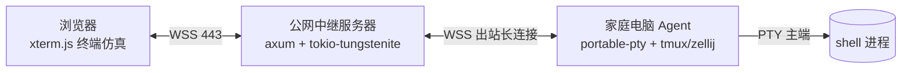

# 浏览器远程终端产品技术研究（供 PRD 引用）

> 目标产品：公网中继服务器 + 无公网家庭电脑 Agent（主动出站连接）+ 浏览器终端（xterm.js）
> 技术前提（用户指定，本报告负责核验与取舍）：React 19、Vite 8、Radix UI、shadcn/ui、Tailwind CSS、Oxc 工具链、Rust 后端；优先采用成熟库。
>
> **信息核对日期：2026-08-04**。本报告只基于一手来源（官方文档、标准文本、官方仓库源码/发布说明），不引用二手转述。所有版本号均标注核对日期；凡属推断处标注 `[INFERENCE]`。本报告不含 PRD 内容。

---

## 0. 摘要与关键取舍（TL;DR）

| # | 决策点 | 结论 | 一句话理由 |
|---|--------|------|-----------|
| 1 | 终端仿真器 | **直接用 xterm.js 6.0.0**，不自行实现 | 业界事实标准（VS Code/Hyper/Tabby 同源），零依赖核心，官方 13 个插件覆盖搜索/WebGL/图像/序列化等 |
| 2 | 传输层 | **浏览器↔中继：WSS（WebSocket over TLS），二进制数据帧 + JSON 控制帧**；WebRTC/QUIC 不做首版 | 浏览器端有序可靠、无需 NAT 穿越；RFC 6455；WebTransport 仅 Safari 26.4+（2026 年才落地），WebRTC 在中继架构下无收益 |
| 3 | 会话持久化 | 首选 **Agent 侧 tmux/zellij**（或等价进程外复用器）为“永不丢会话”兜底；产品层用 `@xterm/headless` + `addon-serialize` 快照重连 | xterm.js 官方重连模式；tmux/zellij 是十年级打磨的成熟方案，自带 detach/attach 与多端 |
| 4 | PTY | **portable-pty（wezterm 出品）**：Linux/macOS 原生 openpty、Windows ConPTY，跨平台 trait 抽象 | 官方维护、活跃（0.9.0），`native_pty_system()` 运行时选择实现 |
| 5 | 加密模型 | 默认 **TLS 全链路 + 中继在信任边界内**；提供“会话级 E2EE（Noise XX/IK over WSS）”为可选高级模式 | E2EE 与中继侧审计/录像、permessage-deflate 压缩不可兼得，产品需先选边界（§6、§9.4） |
| 6 | 认证 | 浏览器：短时 JWT + WebAuthn（可选）；Agent 配对：**OAuth2 设备授权流（RFC 8628）**；Agent 出站连接用 mTLS 或独立会话密钥 | 设备流是“无公网设备完成授权”的标准做法；mTLS 给中继可撤销的设备身份 |
| 7 | 背压 | 在 WS 之上实现 **ACK 窗口流控**（xterm.js 官方流控指南的跨层方案）；xterm.js 内部 write 缓冲硬上限 50MB | 浏览器 WebSocket 无应用层流控，`bufferedAmount` 只是观测；`term.write` 回调是唯一可靠反馈 |
| 8 | 录屏 | **在 Agent 侧捕获 PTY 原始字节流，写成 asciinema v2（NDJSON）**；不在浏览器端录制 | 浏览器渲染只是投影；录像必须录“事实”（字节流+时间戳），asciinema v2 是事实标准（header+事件流） |
| 9 | 文件传输 | **不走 PTY 字节流**；独立二进制 WS 通道（分块 + SHA-256 + 断点续传）；ttyd 的 ZMODEM/trzsz 为带内先例但需转义处理 | 混入终端流会引入转义注入、流控与重连一致性难题（§9.2） |
| 10 | 明确不自研 | 终端仿真、转义解析、PTY、WebSocket、加密原语、复用器、虚拟滚动、UI 基元、HTTP/3 | 全部有成熟库/标准；自研边界只在“会话编排、输入仲裁、审计流水线、认证集成”（§10） |

---

## 1. 研究范围、方法与来源约定

本报告回答以下问题（对应产品立项前的技术核查）：

1. 现代终端到底有哪些“高级能力”（转义序列、图像、剪贴板、键盘、壳集成、渲染），浏览器侧用什么实现，各自限制是什么；
2. “公网中继 + 家庭 Agent 主动出站 + 浏览器访问”的候选传输（WebSocket / WebRTC DataChannel / WebTransport-QUIC）与信任模型的产品级比较；
3. Rust 侧 PTY、会话、加密、录像的选型；
4. 浏览器性能/虚拟化/状态保存的库选型；
5. 认证与端到端安全的可行做法与边界；
6. 断线重连、多端并发、审计的边界；
7. 明确“不应自研”的清单。

来源类型与优先级：IETF RFC 文本 > W3C/MDN 规范 > 官方仓库源码与发布说明 > 官方文档站点 > 被广泛引用的事实性规范（如 OSC 8、同步输出）。所有来源 URL 在正文内联，并在 §11 汇总。

---

## 2. 目标架构与组件职责分离

### 2.1 三层拓扑

关键拓扑事实（决定传输与信任模型）：
- 家庭网络无入站端口，Agent **只能主动出站**连中继（WebSocket/TLS 均可穿 NAT/防火墙）；
- 浏览器侧也只需访问公网中继（443），无额外穿越需求；
- 因此“浏览器↔中继”与“中继↔Agent”两段都是普通 TCP/TLS 连接，天然不需要 STUN/TURN（这直接影响 §5 的 WebRTC 结论）。

### 2.2 职责分离矩阵

| 关注点 | 归属组件 | 依据 |
|--------|----------|------|
| **PTY（伪终端）创建、`termios`、进程生命周期** | Agent 侧（Rust） | portable-pty 提供 `PtySystem`/`MasterPty`/`Child` 抽象，`native_pty_system()` 按平台选实现（Windows 为 ConPTY）——https://docs.rs/portable-pty/latest/portable_pty/ |
| **转义序列解析（把字节流变成“屏幕”状态）** | 浏览器侧（xterm.js） | xterm.js 是“前端组件”，README 明确 *“Xterm.js is not a terminal application… can be connected to processes like `bash`… through a library like `node-pty`”*——https://github.com/xtermjs/xterm.js#readme |
| **屏幕渲染、键盘/鼠标/IME 输入采集** | 浏览器侧（xterm.js + addons） | 同上；另见 §4.1 |
| **会话持久化（shell 不因断线退出）** | Agent 侧（tmux/zellij 或产品自管复用器） | tmux `attach-session`/control mode、zellij “bookmarkable persistent sessions”见 §8.1；`@xterm/headless` 用于服务端状态跟踪见 §4.3 |
| **传输（有序、可靠、双向）** | 中继（WebSocket，RFC 6455） | §5 |
| **录像/审计** | Agent 侧录字节流 + 中继侧录元数据 | §8.3、§9.1 |
| **文件传输** | 独立于 PTY 流的二进制通道 | §9.2 |

### 2.3 为什么“终端仿真”必须留在浏览器端

- 交互闭环必须本地完成：击键→PTY 回显的往返延迟由浏览器→中继→Agent 的 RTT 决定，若再加“中继侧二次仿真”，每一帧都要两次往返；
- 键盘修饰键、IME 组合、鼠标协议、剪贴板都是浏览器原生事件，只有 xterm.js 这类组件才能把 `KeyboardEvent` 编码成正确的转义序列；
- xterm.js README 的“What xterm.js is not”同样说明职责边界：它不替你做 PTY，也不替你跑 shell——**仿真与进程管理是两件事**（https://github.com/xtermjs/xterm.js#readme）。

### 2.4 Agent 侧“服务端仿真”的用途（不是替代浏览器仿真）

`@xterm/headless` 是官方提供的 Node 侧无头终端，“keep track of a terminal's state on a remote server where the process is hosted”，配合 `@xterm/addon-serialize` 可在重连时恢复全部状态（https://github.com/xtermjs/xterm.js/tree/master/headless，https://github.com/xtermjs/xterm.js/blob/master/README.md 的 Node.js Support 一节）。用途定位：
- **重连快照**：Agent/中继持有屏幕状态，浏览器重连时一次性下发（替代“回放全部历史字节”）；
- **多人同步**：为晚加入的 viewer 生成一致基线；
- **录像回放的校验**：与服务端字节流录像互相对照。

注意：这**不是**把终端仿真搬到服务端的理由——服务端仿真只用于状态/同步，交互渲染仍在浏览器（§2.3）。

---

## 3. 现代终端能力矩阵

> 序列定义的一手来源：xterm 的 ctlseqs（Invisible Island，补丁 #410，2026-04-19 更新）：https://invisible-island.net/xterm/ctlseqs/ctlseqs.txt

### 3.1 能力矩阵总表

| 能力 | 协议/标准 | 浏览器侧（xterm.js 6.0.0） | 服务端/Agent 侧含义 | 关键来源 |
|------|-----------|---------------------------|---------------------|----------|
| 基础 DA1/DA2/DA3、DECRQM、XTGETTCAP、XTWINOPS | VT 序列 | 支持（`Send Device Attributes`、`Request ANSI mode (DECRQM)`、`XTGETTCAP`、`XTWINOPS` 均在 ctlseqs 定义） | Agent 需如实响应 size/能力查询；XTWINOPS 用于窗口尺寸上报（`CSI 14 t`/`16 t`/`18 t` 等） | ctlseqs.txt |
| Bracketed Paste（`CSI ?2004h` + `CSI 200~`/`201~`） | xterm/常见终端 | 支持（core 处理粘贴括号） | 无需服务端参与；Agent 侧 shell 若启用需知晓 | ctlseqs.txt §Bracketed Paste Mode |
| 剪贴板 **OSC 52**（base64，RFC 4648） | xterm ctlseqs | 6.0 起核心解析；写入需显式打开 `allowClipboardAccess`（默认关）；默认实现走浏览器 Clipboard API（受 Permissions/用户手势约束）；读回受限 | 与 E2EE 边界相关：剪贴板内容同样在加密通道内（§9.4） | xterm.js PR #4220；ctlseqs §“Ps = 5 2 -> Manipulate Selection Data” |
| 超链接 **OSC 8** | 事实规范（GNOME Terminal/VTE + iTerm2 联合定义，Egmont Koblinger gist） | `@xterm/addon-web-links` 处理 URL；OSC 8 本身可被核心透传 | 无需服务端；注意 OSC 8 链接可能被用作钓鱼入口（xterm.js 6.0 fix 中专门处理了 reverse tabnapping 提示） | https://gist.github.com/egmontkob/eb114294efbcd5adb1944c9f3cb5feda；xterm.js 6.0.0 发布说明 #5355 |
| 图像：**Sixel**（VT340）、**iTerm2 IIP**、**Kitty TGP** | DEC SDM（ctlseqs）；IIP/TGP 为 iTerm2/kitty 事实协议 | `@xterm/addon-image`：Sixel/IIP 为 beta 质量，Kitty 为 alpha；内存上限可配（`pixelLimit` 默认 16M 像素、`storageLimit` 默认 128MB、序列大小上限 32MB）；默认开启 XTWINOPS 尺寸上报 | Agent 需透传大字节流；流控压力显著（addon README 专门警告 image 输出更易触发流控问题） | addons/addon-image/README.md |
| 壳集成（**OSC 133 / OSC 633**、prompt 标记、cwd、退出码） | VS Code/iTerm2/FinalTerm 事实协议 | xterm.js 提供 marker/decoration API 供上层实现（VS Code 的 shell integration 即构建在 xterm.js 之上）；xterm.js 不内置 OSC 133/633 的语义 | 若产品要“命令块、退出码徽标、sticky scroll”，需在浏览器侧实现 shell integration 注入脚本与解析；**该功能要求中继/Agent 看到明文**（与 E2EE 冲突，§9.4） | https://code.visualstudio.com/docs/terminal/shell-integration |
| 键盘：**Kitty keyboard protocol**（CSI u，progressive enhancement、push/pop flags） | kitty 官方规范 | 支持（xterm.js 5.x+ 已实现 kitty keyboard） | 无服务端依赖；现代 TUI（fish/helix 等）依赖它区分修饰键 | https://sw.kovidgoyal.net/kitty/keyboard-protocol/ |
| 同步渲染 **DECSET 2026（synchronized output）** | 事实规范（iTerm2 启发，contour/vt-extensions 维护） | 6.0.0 新增支持（PR #5453） | 无需服务端；解决 `find` 等高刷输出撕裂 | https://github.com/contour-terminal/vt-extensions/blob/master/synchronized-output.md；xterm.js 6.0.0 release |
| 进度条 **OSC 9;4** | iTerm2 事实协议 | `@xterm/addon-progress`（6.0 新增） | 无服务端依赖 | addons/addon-progress/README.md |
| Unicode：CJK/emoji/IME；Unicode 11 宽度；字素簇 | Unicode 标准 | 核心支持 CJK/emoji/IME；`@xterm/addon-unicode11` 把宽度表更新到 Unicode 11；`@xterm/addon-unicode-graphemes`（实验）合并字素簇 | CJK 场景（本项目）**必须启用 unicode11**，否则全角宽度错误 | https://github.com/xtermjs/xterm.js#readme（Rich Unicode support）；addons/addon-unicode11 |
| 连字（ligatures） | — | `@xterm/addon-ligatures`；6.0 支持 detailed ligatures（PR #5285） | 纯渲染；WebGL 下光标/选中与连字联动已在 6.0 修复 | addons/addon-ligatures；6.0.0 release |
| 网络字体/emoji（COLRv1） | — | `@xterm/addon-web-fonts`；注意字体必须预加载否则度量错乱（addon 有专门说明） | 纯渲染 | addons/addon-web-fonts/README.md |
| 搜索 | — | `@xterm/addon-search`（6.0 引入 SearchLineCache 加速） | 纯浏览器 | addons/addon-search；6.0.0 release |
| 状态序列化（VT 序列或 HTML） | — | `@xterm/addon-serialize`（实验性 addon） | 重连/协作基线（§4.3） | addons/addon-serialize/README.md |

### 3.2 需要产品决策的几个“能力层”

1. **shell integration 是否纳入首版**：它带来命令导航/退出码/建议等差异化体验，但要求明文可见（§9.4 冲突）且注入脚本跨 shell 维护成本高。建议首版**不做**，保留 OSC 52/8、bracketed paste 等零成本能力。
2. **图像支持（Sixel/IIP）**：beta 质量、内存峰值可达百 MB 级、对传输与流控压力大。建议首版关或默认受限，作为后续开关。
3. **Kitty keyboard protocol**：直接启用，成本低收益高（现代 TUI 体验正确性）。

---

## 4. 浏览器端选型

### 4.1 xterm.js 6.0.0（核心 + 官方插件）

- 仓库：https://github.com/xtermjs/xterm.js；npm：`@xterm/xterm`；**当前版本 6.0.0**（2025-12-22 发布；本报告克隆的主分支提交 904ae93，2026-07-26）。MIT。
- 核心特性（README）：CJK/emoji/IME、可选 GPU（WebGL2）渲染、零依赖核心、无障碍（screen reader mode）、主题/自定义字形/插件 API。
- 浏览器支持（README）：官方只承诺最新版 Chrome/Edge/Firefox/Safari（evergreen），亦支持 Electron。
- 官方维护插件 13 个（README 列表）：`addon-attach`（直连 WebSocket）、`addon-clipboard`（剪贴板提供方抽象）、`addon-fit`（自适应尺寸）、`addon-image`、`addon-ligatures`、`addon-progress`（OSC 9;4）、`addon-search`、`addon-serialize`（状态序列化）、`addon-unicode-graphemes`（实验）、`addon-unicode11`、`addon-web-fonts`、`addon-web-links`、`addon-webgl`。
- 6.0.0 关键变化（发布说明）：新增 DECSET 2026 同步输出、OSC 52、ESM 构建（#5092）、`onWriteParsed` API、progress addon、WebGL shadow DOM、overview ruler 与滚动条重构（**破坏性**）、移除已废弃的 `windowsMode`/`fastScrollModifier`（**破坏性**）。
- 常用选项（typings/xterm.d.ts 原文）：`allowProposedApi`（默认 false，实验 API 需显式打开）；`scrollback`（默认 1000 行）；`convertEol`、`screenReaderMode` 等。

### 4.2 性能、流控与内存边界（重要事实）

- xterm.js 官方流控指南（https://xtermjs.org/docs/guides/flowcontrol/）：
  - `term.write` 非阻塞，内部按 ≤16ms/帧 的时间片处理；解析吞吐约 5–35 MB/s，而“极快生产方”可达数 GB/s；
  - **内部 write 缓冲硬编码上限约 50MB**，超出即丢弃数据（源码 `src/common/input/WriteBuffer.ts` 注释）；
  - 单 chunk 回调式流控最低效（每 chunk pause/resume）；推荐**水位线（watermark HIGH/LOW）**或**每 N 字节回调**；
  - **WebSocket 之上没有协议级流控钩子**，官方方案：客户端以 `term.write` 回调驱动向服务端发自定义 ACK，服务端据此暂停/恢复 PTY 读（“ACK 窗口”）。本项目必须实现该模式。
- WebGL 渲染：`@xterm/addon-webgl` 用 canvas webgl2 context；需处理 `webglcontextlost`（addon README 给出 dispose 模式）。
- 图像内存：`addon-image` README 给出公式：解码期峰值 ≈ `sixelSizeLimit + 2 × pixelLimit × 4` 字节（16M 像素 ≈ 128MB），存储 ≈ `storageLimit`（默认 128MB）。（§3.1 已列）

### 4.3 状态保存与恢复（浏览器性能/虚拟化/状态保存库）

- **终端虚拟化不需要外部库**：xterm.js 本身就是“只渲染视口 + 滚动回看缓冲”的虚拟化网格（`scrollback` 选项控制保留行数，默认 1000）。
- 需要虚拟化的地方是**终端以外的长列表 UI**（文件浏览器、会话列表、日志面板）：用 **TanStack Virtual**（headless、框架无关、10–15kb、60FPS：https://github.com/TanStack/virtual）。
- **状态保存**双轨：
  1. 官方推荐模式：`@xterm/headless`（Node 侧无头终端）+ `@xterm/addon-serialize` 序列化全部缓冲为 VT 序列，重连恢复（README 明确此用例）；注意 serialize 为“实验性 addon”。
  2. 生产更稳的补充：Agent 侧环形缓冲最近 N 行字节 + 快照；或直接以 tmux/zellij 会话为持久层（§8.1）。

### 4.4 前端技术栈核验（用户指定项，逐一对照官方资料）

| 项 | 官方事实（截至 2026-08-04） | 对本项目的含义 |
|----|-----------------------------|----------------|
| **React 19** | 2024-12-05 发布稳定版（https://react.dev/blog/2024/12/05/react-19）：Actions、`useOptimistic`、`use`、`<form>` Actions、React DOM 静态 API 等 | xterm.js 是**命令式**组件：用 ref + effect 挂载/销毁，勿把终端 DOM 交给 React 协调；React 19 本身无阻碍。**没有官方 React 封装**（xterm.js 插件列表里无 react addon），社区封装（如 xterm-for-react）维护状态参差，建议自写薄封装层 `[INFERENCE]` |
| **Vite 8** | 2026-03-12 发布（https://vite.dev/blog/announcing-vite8）：**Rolldown（Rust）统一打包器**替代 esbuild+Rollup；构建快 10–30x；要求 Node 20.19+/22.12+；内置 lightningcss；`@vitejs/plugin-react` v6 用 **Oxc** 做 React Refresh | 符合“Oxc 工具链”方向；注意 Vite 8 为 ESM-only 发布、插件兼容层自动转换 esbuild/rollupOptions |
| **Tailwind CSS v4** | 2025-01-22 发布 v4.0（现 v4.3）（https://tailwindcss.com/blog/tailwindcss-v4）：CSS-first 配置（`@theme`）、原生 cascade layers、`color-mix()`、oklch 调色板、`@tailwindcss/vite` 官方 Vite 插件 | v4 主题变量即 CSS 变量，便于和 xterm 主题联动；**不要引入 v3 的 tailwind.config.js 工作流** |
| **Radix UI（Primitives）** | “Unstyled, accessible, open source React primitives”；月下载 130M+（https://www.radix-ui.com/primitives） | 对话框/下拉/弹层/滚动区等基元；本项目 UI 面不大，按需引入即可 |
| **shadcn/ui** | 官方自述：“This is not a component library. It is how you build your component library”——开源代码分发平台（registry + CLI）；底层 headless 组件为 `@base-ui/react` 或 `input-otp` 等（FAQ）（https://ui.shadcn.com/docs） | 复制进项目的代码模式，适合终端产品定制主题；注意它不是运行时依赖库 |
| **TanStack Query v5** | “async state management…caching, refetching, pagination…mutations”（https://github.com/TanStack/query） | 用于 REST 侧数据（会话列表、设备状态、审计查询）；**终端的实时字节流不要走它**，直接驱动 xterm.js |
| **Zustand v5** | “A small, fast and scalable bearbones state-management solution”（v5 迁移文档存在：https://github.com/pmndrs/zustand/tree/main/docs/reference/migrations/migrating-to-v5） | 适合连接状态、UI 状态等本地状态；终端数据流经外部 store 会引发不必要的重渲染——**xterm 数据不进 React 渲染管线** |
| **Oxc 工具链** | oxlint/oxfmt/parser/transformer/minifier/resolver；Rolldown 与 Vite 8 使用 Oxc 解析/转换/压缩（https://github.com/oxc-project/oxc）；xterm.js 自身已用 oxlint（仓库内 `.oxlintrc.json`） | 用户指定“Oxc 工具链”已由 Vite 8 + oxlint 落地，无需额外工具 |

---

## 5. 传输层选型：WebSocket / WebRTC DataChannel / WebTransport(QUIC)

### 5.1 三者对比（一手来源：RFC 6455/7692、RFC 8831/8832、RFC 9000/9114/9221、W3C WebTransport + MDN BCD）

| 维度 | WebSocket（WSS） | WebRTC DataChannel | WebTransport（HTTP/3） |
|------|------------------|--------------------|------------------------|
| 协议基础 | RFC 6455，运行于 TCP：“opening handshake followed by basic message framing, layered over TCP”（rfc6455 §1.1）；有序、可靠、全双工 | RFC 8831：SCTP over DTLS over UDP（PR-SCTP 可部分可靠）；`DATA_CHANNEL_OPEN`（RFC 8832）携带 ordered/priority 参数 | W3C WebTransport API；QUIC（RFC 9000）之上的双向/单向流 + 不可靠 datagram（RFC 9221）；HTTP/3（RFC 9114） |
| 有序可靠 | ✅ 天然 | ✅/❌ 可选（ordered + reliable/partial） | ✅ 流（可靠、流间无序）/ ❌ datagram |
| 背压 | ❌ 无应用层流控；客户端只能观测 `bufferedAmount`（MDN：send 后未发到网络的字节数）；需自定义 ACK 窗口（xterm.js 指南） | ✅ `DataChannel` send/try_send 带发送缓冲背压（webrtc-rs 文档） | ✅ 流式背压（ReadableStream/WritableStream + QUIC 流控） |
| 压缩 | ✅ permessage-deflate（RFC 7692，扩展协商） | ❌ 无标准 | ❌ 无应用层（QUIC 仅头部压缩） |
| 加密 | TLS 1.3（RFC 8446），终点=中继 | DTLS（1.2），终点=对端 | TLS 1.3（RFC 9000 内建），终点=中继 |
| NAT 穿越 | ❌ 不需要（TCP 出站即可） | 需要 ICE/STUN/TURN（RFC 8445 体系） | 不需要协商，但要求 UDP 出站 443 |
| 浏览器支持 | 全平台 | 全平台 | **Chrome 97+、Edge 97+、Firefox 114+、Safari 26.4+**（MDN BCD：https://github.com/mdn/browser-compat-data/blob/main/api/WebTransport.json）；Safari 2026 年才落地 |
| Rust 服务端 | ✅ tokio-tungstenite 0.30 / axum 0.8.9 | ✅ webrtc 0.20（webrtc-rs，Sans-I/O `rtc` 内核） | ✅ quinn 0.11.11 / wtransport 0.7.1（crates.io 存在性已核验，API 未逐项审读 `[INFERENCE]`） |
| 中继架构适配度 | ★★★ 主选 | ★ 不推荐 | ★★ 可选演进 |

### 5.2 WebSocket：主选（结论 + 依据）

- RFC 6455 保证有序可靠，正好匹配“终端字节流必须按序到达”；消息分帧天然区分控制消息与数据；
- 文本帧=UTF-8、二进制帧两类（rfc6455 §5.6），可分别承载 JSON 控制消息与二进制数据帧；
- 客户端→服务端掩码（rfc6455 §5.3/§10.3）是防缓存投毒/请求走私的机制，**不是机密性**；机密性由 TLS 承担；
- 背压短板用 §4.2 的 ACK 窗口补齐（xterm.js 官方方案）；
- `permessage-deflate`（RFC 7692）建议中继开启以压缩冗余文本输出；**若启用会话级 E2EE 则必须关闭**（先加密再压缩无意义且会破坏长度隐藏，§9.4）。

### 5.3 WebRTC DataChannel：不推荐（理由）

- 本架构两端都是“客户端→公网中继”，TCP/TLS 直连即可；DataChannel 引 ICE/STUN/TURN 纯增复杂度；
- DataChannel 的 DTLS 加密**只覆盖浏览器↔中继**，不到达 Agent——若目标是“中继不可读”，它毫无帮助，仍需应用层 E2EE（§6）；
- “浏览器↔Agent 点对点直连”的唯一好处被拓扑否决：Agent 无入站，任何 P2P 都要经 TURN（即中继转交），且浏览器端还要再走一次 UDP 打洞，得不偿失；
- webrtc-rs（0.20）活跃且质量好（Sans-I/O 重构：https://webrtc.rs/blog/2026/01/31/webrtc-v0.17.0-feature-freeze-sansio-shift.html），但属于“好库用错地方”。

### 5.4 WebTransport：可选演进（保留评价）

- 优点：0-RTT/多路复用/单向流（适合录屏回放旁路、文件传输独立流）、流式背压、QUIC 自带 TLS 1.3；
- 缺点：UDP 出站在个别网络被禁；**Safari 26.4+ 才支持**（2026 年新增），对消费级浏览器产品是硬约束；Rust 服务端生态（wtransport 0.7.1）成熟度低于 WS；
- 结论：首版不做；协议设计时把“数据通道”抽象成接口，未来可平滑换 WebTransport（同一条 443 端口可并存 HTTP/3）。

### 5.5 建议的消息协议形状

- 同一 WSS 连接上区分帧类型：`JSON 控制帧`（resize、ACK、attach/detach、心跳、错误）+ `二进制数据帧`（PTY 输出、文件传输块）+ `JSON 事件帧`（退出码、shell integration 事件，如启用）；
- 帧头含单调递增序号用于重连对齐（“从第 N 字节续传”）`[INFERENCE]`；
- 心跳：参考 ttyd 默认 `--ping-interval 5`（https://github.com/tsl0922/ttyd）做应用层 ping/pong（WS ping 也行，但应用层可携带会话 ID）。

---

## 6. 中继与信任模型（产品级比较）

### 6.1 拓扑事实（见 §2.1）

- Agent 持有到中继的**出站长连接**（可带 mTLS 或应用层设备密钥）；
- 浏览器按需建 WSS 到中继；中继做“会话寻址 + 转发 + 权限校验”；
- 中继是双方都可达的唯一汇合点，天然是信任锚与审计点。

### 6.2 威胁模型（假设）

- 中继服务器被攻破/被合法窥探（云厂商、托管方）；
- 传输被窃听（已由 TLS 覆盖）；
- 会话劫持（凭据泄漏、重放）；
- Agent 冒充（伪造设备注册）；
- 浏览器端恶意终端程序（如 `printf` 输出恶意 OSC 52 尝试读浏览器剪贴板——见 xterm.js PR #4220 中维护者的安全讨论：剪贴板访问默认关闭、xterm 用 `allowWindowOps` 约束）。

### 6.3 三种信任模型

| 模型 | 数据可见性 | 中继侧录像/审计 | 关键代价 | 参考实现/标准 |
|------|-----------|----------------|----------|---------------|
| **A. TLS-only（中继在信任边界内）** | 中继可见明文 | ✅ 可录屏、可查内容 | 需要用户信任托管方；泄露面=中继 | 大多数产品（ttyd/gotty/wetty 等），TLS 1.3（RFC 8446） |
| **B. 应用层 E2EE（Noise over WSS）** | 仅浏览器与 Agent 可见；中继只见密文+元数据 | ❌ 内容级审计不可行（只能记元数据） | 无中继压缩（关 permessage-deflate）；无中继内容审计；密钥生命周期/吊销需自管；OSC 52 剪贴板与文件传输同样加密（一致性好） | Noise 协议（noiseprotocol.org）；Rust `snow` 0.10；JS 侧 `@chainsafe/libp2p-noise`（活跃，v17）或 WebCrypto X25519（caniuse 有条目） |
| **C. MLS 群组 E2EE（RFC 9420）** | 仅成员可见；前向保密/后向保密按 epoch | ❌ 同上 | 服务端需跑分配服务（delivery service）；复杂度高；早期不建议 | RFC 9420（MLS） |

关键权衡：**“中继内容级审计/录像”与“中继不可读”在产品上是二选一**。建议：
- 默认模型 A（TLS + 中继审计），面向绝大多数个人自托管用户，运维与排障简单；
- 提供“机密会话”开关走模型 B（每次会话新建 Noise XX 握手，X25519 + ChaCha20-Poly1305，参考 `snow` 的 `Noise_XX_25519_ChaChaPoly_BLAKE2s` 模式）；该会话在中继无录像（或仅存“密文归档+会话密钥由 Agent 加密保存”的合规折中）；
- 模型 C 仅在“多人协作 + 强隐私声明”成为卖点后再评估。

### 6.4 认证与零信任要点

- 浏览器登录：短时 JWT（RFC 7519）会话 + 可选 WebAuthn/passkey（MDN Web Authentication）；CSRF/同源约束由 Cookie 或显式 token 头处理；
- **Agent 配对：OAuth 2.0 设备授权流（RFC 8628）**——无公网设备的标准授权路径（用户码 + verification URI，非交互设备专用）；RFC 8628 明文说明其设计目标“does not require two-way communication”且针对浏览器外设备；
- Agent 出站连接：mTLS 或“注册时换发的长期设备密钥 + 每次连接会话密钥”；吊销=撤销设备凭证，Agent 立即断连；
- 会话寻址：随机不可猜会话 ID（≥128 bit `[INFERENCE]`），中继侧 ACL 绑定会话→允许用户/设备；
- 审计（模型 A）：中继记录连接/断开/来源/时长/字节数/会话归属，不落终端内容以外的明文（§8.3）。

---

## 7. Rust 后端选型

### 7.1 PTY：portable-pty（wezterm 项目）

- **0.9.0**（2026-08-04 于 crates.io 核验）；https://docs.rs/portable-pty/latest/portable_pty/
- 官方描述：跨平台 PTY API，trait 化（`PtySystem`/`MasterPty`/`SlavePty`/`Child`），**运行时选择实现**（Linux/macOS 原生 pty，Windows ConPTY）；wezterm 生产使用；
- Windows 侧机制：Windows 伪控制台 ConPTY——微软官方文档：“relay the information from the pseudoconsole channels out to a different channel or device including a network to remote information to another process or machine and avoiding any local transcoding”（https://learn.microsoft.com/en-us/windows/console/creating-a-pseudoconsole-session）——与“Agent 把 PTY 流原样上送中继”的设计完全一致；
- 注意：PTY 尺寸（rows/cols/pixel）变化要下发 `resize`（`PtySize`），浏览器侧用 fit addon 采集。

### 7.2 转义解析与屏幕模型

- **vte 0.15.0**（https://docs.rs/vte/latest/vte/）：alacritty 同款 ANSI 解析器（Paul Williams 状态机），`Parser`+`Perform` 两态分离，只解析不赋予语义——适合 Agent 侧做“安全解析校验/统计”（可选）；
- **vt100 0.16.2**（https://docs.rs/vt100/latest/vt100/）：内存屏幕模型，`contents_diff` 增量输出——官方用例就是 screen/tmux 类程序；用于 Agent 侧回放渲染/验证（如服务端预览缩略图）可选。

### 7.3 HTTP / WebSocket 服务（中继）

- **axum 0.8.9**（https://docs.rs/axum/latest/axum/）：tokio/hyper 之上的路由框架，内置 WebSocket extractor（`axum::extract::ws`），Tower 中间件生态；
- **tokio-tungstenite 0.30.0**（https://docs.rs/tokio-tungstenite/latest/tokio_tungstenite/）：WebSocket 客户端/服务端；**Agent 出站连接用它**（`client_async_tls` 支持 TLS）；支持 `disable_nagle` 降低小包延迟；
- **tokio 1.53.1**（运行时）。

### 7.4 会话、缓冲与背压（Agent 侧）

- 会话模型：一个“会话”= 一个 PTY（或一个 tmux/zellij 会话）+ 订阅者集合；会话元数据（ID、所有者、创建时间、当前订阅者）入中继状态（内存或 Postgres/SQLite，按部署规模）；
- 背压实现：PTY 读→环形缓冲→按订阅者各自 ACK 窗口发送；慢订阅者不阻塞快订阅者（可参考 tmux control mode 的 `pause-after=seconds` 语义：输出落后则暂停该客户端，https://man.archlinux.org/man/tmux.1.en 对应上游 man 页）。
- 持久化：§8.1。

### 7.5 加密

- **snow 0.10.0**（https://docs.rs/snow/latest/snow/）：Noise 协议实现（官方文档直连 noiseprotocol.org），支持 `Noise_XX_25519_ChaChaPoly_BLAKE2s` 等模式，ring 加速可选——模型 B 的 Agent 侧实现；
- JS 侧对称实现：`@chainsafe/libp2p-noise`（活跃维护，https://github.com/ChainSafe/js-libp2p-noise）或 WebCrypto 的 X25519（caniuse：`mdn-api_subtlecrypto_derivekey_x25519` 等条目存在；具体矩阵以 caniuse 为准 `[INFERENCE]`）；
- 哈希校验：SHA-256（文件传输分块）；不要自写 AEAD。

### 7.6 可选（不做首版）

- **quinn 0.11.11**（https://docs.rs/quinn/latest/quinn/）：纯 Rust QUIC；**wtransport 0.7.1**：Rust WebTransport 服务端（crates.io 核验存在；API 本报告未逐项审读）——WebTransport 演进的储备；
- **webrtc 0.20.0**（webrtc-rs）：DataChannel 等（§5.3 已论证不用于本架构）。

---

## 8. 断线重连 / 多端 / 审计

### 8.1 断线重连（分层设计）

1. **Agent↔中继**：断线后指数退避+抖动重连（参考成熟客户端惯例 `[INFERENCE]`）；重连后以设备凭证换新会话密钥；Agent 侧会话（shell 进程）**不因传输断开而退出**——这正是 tmux/zellij 的价值。
2. **浏览器↔中继**：重连时携带“会话 ID + 期望的字节水位/快照版本”；
3. **状态同步三选一**（按成本排序）：
   - a) `@xterm/headless` + `addon-serialize` 快照：官方推荐模式（README Node.js Support 一节），恢复全部屏幕状态；对超长会话，快照体积可能很大（serialize 支持 `range` 选项，6.0 PR #5436）；
   - b) Agent 环形缓冲重放最近 N 秒字节（配合序号对齐）——简单且与录像同源；
   - c) tmux/zellij 会话 attach（复用器自带 attach 语义：tmux `attach-session`、control mode `-C`；zellij “bookmarkable persistent sessions… resurrect” https://zellij.dev/tutorials/web-client/）——能力最全但把产品体验绑定到复用器 UI。
4. 建议：**首版 = b) 环形缓冲重放；预留 a) 作为“会话恢复”高级特性**。

### 8.2 多端并发

- 单 PTY，多订阅者（viewer 只读 / writer 可写）：
  - 输入仲裁：单一 primary writer，其余 viewer 只读；或加锁切换。先例：zellij web client 提供**只读 token**（`zellij web --create-read-only-token`，官方教程）；tmux `read-only` 客户端 flag；
  - 输出扇出：各自 ACK 窗口（§7.4），慢者被暂停不拖垮全局（tmux `pause-after` 先例）；
  - 晚加入者：按 §8.1 的同步方案得到一致基线；
- 会话上限：ttyd 的 `--max-clients` 先例（默认无限制，README 有说明）。

### 8.3 审计边界（明确“记什么、不记什么”）

| 审计内容 | 模型 A（TLS-only） | 模型 B（E2EE） |
|----------|-------------------|----------------|
| 连接/断开/来源 IP/时长/字节数/会话归属 | ✅ 中继记录 | ✅ 中继记录（元数据） |
| 终端内容（字节流） | ✅ 中继可录（录屏方案见 §9.1） | ❌ 中继不可见；仅 Agent 可录 |
| 命令历史/退出码（shell integration） | ✅ 若启用 | ❌ 不可见 |
| 密钥/凭证事件（注册、吊销、轮换） | ✅ | ✅ |

合规折中（如确有监管要求）：Agent 用会话密钥加密录像归档，审计时凭“用户授权+密钥取用”解密——密钥管理即权限管理 `[INFERENCE]`。

---

## 9. 录屏 / 文件传输 / 协作 / E2EE 边界

### 9.1 录屏

- **格式：asciinema v2**（https://docs.asciinema.org/manual/asciicast/v2/）：NDJSON；首行 header（必填 `version`/`width`/`height`；可选 `timestamp`/`duration`/`idle_time_limit`/`command`/`title`/`env`/`theme`），后续每行一个 3 元素事件 `[时间, 类型, 数据]`，类型含 `o`（输出）/`i`（输入）/`m`（标记）/`r`（resize）；
- **录制位置：Agent 侧**，直接捕获 PTY 读出的原始字节流+时间戳——与浏览器无关，浏览器离线也不丢帧；
- 重放：浏览器端自己渲染 cast（基于 xterm.js）或引入现成播放器；播放器库非本报告范围 `[INFERENCE]`；
- 不要用“浏览器 DOM 录制/截图流”当录屏（丢失转义语义、不可搜索）。

### 9.2 文件传输边界

- **不要混入 PTY 字节流**：终端流是“按序字符流”，混入二进制会触发转义解析歧义、流控混乱、重连一致性断裂；
- 推荐：独立二进制 WS 通道（同连接不同消息类型，或独立连接），**分块 + SHA-256 + 断点续传 + 配额/速率限制**；浏览器侧无原生文件系统，用 File System Access API（有权限门槛）或直接上传/下载；
- 带内先例：ttyd 通过 ZMODEM（lrzsz）/ trzsz 在终端流内做文件传输（README Features）——可行但对转义处理要求高，且会污染录像；除非产品明确要“`sz`/`rz` 兼容”，否则走旁路通道；
- 安全：Agent 侧必须做路径/权限校验（防止经浏览器通道读写任意路径）；目录浏览/传输走单独 REST/WS 接口 + 授权。

### 9.3 协作

- 参考 zellij web client（0.43.0+ 内置 web 服务：token 认证、只读 token、按 URL 附着/复活会话，官方教程 https://zellij.dev/tutorials/web-client/）与 tmux（control mode/read-only/pause-after）；
- 协作语义建议：主控（可写）+ 观众（只读，缺省）；“接管”= 主控权转移（需确认流程，防互踩）`[INFERENCE]`；
- shell integration 事件（如退出码徽标）在多人下按会话共享。

### 9.4 端到端加密边界（模型 B）

| 面 | 状态 |
|----|------|
| PTY 双向字节流 | 加密（每次会话 Noise XX 握手，X25519+ChaCha20-Poly1305，`snow` + JS 侧等价实现） |
| OSC 52 剪贴板数据 | 加密（它只是终端流的一部分） |
| 文件传输块 | 加密（同一会话密钥派生子密钥，`[INFERENCE]` 建议 HKDF 派生避免跨用途重放） |
| 元数据（时间、大小、连接模式） | 中继可见（无法隐藏） |
| shell integration（OSC 133/633 语义） | **冲突**：退出码/命令解析要求中继或浏览器侧明文逻辑——E2EE 会话应关闭壳集成或只在端侧解析 |
| permessage-deflate 压缩 | **冲突**：RFC 7692 在 TLS 内、E2EE 之前做透明压缩，先加密后压缩无收益且增大体积/时序泄露——E2EE 会话必须禁 |
| 中继侧录像/审计 | **冲突**：模型 B 中继不可录内容（§8.3） |
| 密钥生命周期 | 每次会话临时密钥（前向保密）；吊销=撤销设备凭证并杀会话；无中继托管密钥（避免密钥托管成为单点） |

结论：E2EE 是**产品承诺**而不是“加个库就完事”——它同时关闭中继审计、内容压缩、壳集成三大能力，必须由 PRD 明确取舍（§6.3 已建议默认模型 A + 可选机密会话）。

---

## 10. 明确“不应自研”与“应自研”的清单

不应自研（成熟替代 + 一手来源见 §4/§5/§7）：

| 领域 | 用现成的 | 原因 |
|------|----------|------|
| 终端仿真器 | xterm.js 6.0.0 | 业界标准、零依赖、插件生态 |
| 转义序列解析 | vte（Rust）/ xterm.js（浏览器） | ANSI 状态机极难正确 |
| PTY | portable-pty（/ConPTY） | 跨平台细节（termios、ConPTY 死锁陷阱）已封装 |
| WebSocket | tokio-tungstenite / axum / 浏览器原生 WS | RFC 6455 实现 + TLS 栈 |
| 加密原语 | snow / libsodium / WebCrypto / libp2p-noise | 密码学禁止自研 |
| 会话复用器 | tmux / zellij | 十年级成熟；自带 attach/read-only/control mode |
| 录像格式 | asciinema v2 | 事实标准，可回放可分享 |
| 虚拟滚动 | xterm.js 内置 + TanStack Virtual | 已含视口虚拟化 |
| UI 基元 | Radix / shadcn | 可访问性细节难自研 |
| 构建工具链 | Vite 8（Rolldown/Oxc）、oxlint/oxfmt | 与用户指定栈一致 |
| HTTP/3 | quinn / wtransport（演进） | QUIC 栈复杂 |

应自研（产品差异化，无现成答案）：

1. **会话编排**（会话↔PTY↔订阅者↔权限的映射与状态机）；
2. **输入仲裁与主控权**（§9.3）；
3. **ACK 窗口背压 + 重连对齐协议**（§4.2/§5.5，参照 xterm.js 官方指南，需自写）；
4. **审计流水线**（§8.3：元数据日志、可选录像归档与解密流程）；
5. **认证/授权集成**（§6.4：设备流、token 生命周期、吊销）。

---

## 11. 参考来源汇总（按主题分组）

### 终端仿真与协议
- xterm.js 仓库/README（功能、插件、浏览器支持、headless 用例）：https://github.com/xtermjs/xterm.js
- xterm.js 6.0.0 发布说明：https://github.com/xtermjs/xterm.js/releases/tag/6.0.0
- xterm.js 流控指南（50MB 缓冲上限、水位线、WS ACK 方案）：https://xtermjs.org/docs/guides/flowcontrol/
- xterm.js typings（`allowProposedApi`、`scrollback`、`onWriteParsed`）：https://github.com/xtermjs/xterm.js/blob/master/typings/xterm.d.ts
- xterm.js OSC 52 支持 PR（allowClipboardAccess 默认关、addon-clipboard）：https://github.com/xtermjs/xterm.js/pull/4220
- addon-image（Sixel/IIP/Kitty、内存限制）：https://github.com/xtermjs/xterm.js/tree/master/addons/addon-image
- addon-serialize / addon-webgl / addon-clipboard / addon-progress / addon-web-fonts / addon-attach：https://github.com/xtermjs/xterm.js/tree/master/addons
- @xterm/headless：https://github.com/xtermjs/xterm.js/tree/master/headless
- xterm ctlseqs（DA/DECRQM/XTGETTCAP/XTWINOPS/bracketed paste/OSC 52/Sixel，patch #410）：https://invisible-island.net/xterm/ctlseqs/ctlseqs.txt
- OSC 8 超链接规范（VTE/iTerm2 联合）：https://gist.github.com/egmontkob/eb114294efbcd5adb1944c9f3cb5feda
- 同步输出（DECSET 2026）规范：https://github.com/contour-terminal/vt-extensions/blob/master/synchronized-output.md
- Kitty keyboard protocol：https://sw.kovidgoyal.net/kitty/keyboard-protocol/
- VS Code shell integration（OSC 633 语义）：https://code.visualstudio.com/docs/terminal/shell-integration
- Windows ConPTY 官方文档：https://learn.microsoft.com/en-us/windows/console/creating-a-pseudoconsole-session
- asciinema v2 格式：https://docs.asciinema.org/manual/asciicast/v2/

### 传输与标准
- RFC 6455（WebSocket）：https://www.rfc-editor.org/rfc/rfc6455.txt
- RFC 7692（permessage-deflate）：https://www.rfc-editor.org/rfc/rfc7692.txt
- RFC 8831（SCTP-based DataChannels）：https://www.rfc-editor.org/rfc/rfc8831.txt
- RFC 8832（DCEP）：https://www.rfc-editor.org/rfc/rfc8832.txt
- RFC 9000（QUIC）/ RFC 9114（HTTP/3）/ RFC 9221（datagrams）：https://www.rfc-editor.org/rfc/rfc9000.txt 等
- WebTransport（MDN）：https://developer.mozilla.org/en-US/docs/Web/API/WebTransport
- WebTransport 浏览器兼容（MDN BCD）：https://github.com/mdn/browser-compat-data/blob/main/api/WebTransport.json
- WebSocket.bufferedAmount（MDN）：https://developer.mozilla.org/en-US/docs/Web/API/WebSocket/bufferedAmount

### 安全与认证
- RFC 8446（TLS 1.3）/ RFC 7748（X25519）：https://www.rfc-editor.org/rfc/rfc8446.txt 等
- RFC 8628（OAuth 2.0 设备授权流）：https://www.rfc-editor.org/rfc/rfc8628.txt
- RFC 9420（MLS）：https://www.rfc-editor.org/rfc/rfc9420.txt
- Noise 协议：https://noiseprotocol.org/noise.html
- snow（Rust Noise）：https://docs.rs/snow/latest/snow/
- @chainsafe/libp2p-noise（JS Noise）：https://github.com/ChainSafe/js-libp2p-noise
- WebCrypto X25519 兼容性：https://caniuse.com/mdn-api_subtlecrypto_derivekey_x25519

### Rust 库
- portable-pty：https://docs.rs/portable-pty/latest/portable_pty/
- vte：https://docs.rs/vte/latest/vte/ ；vt100：https://docs.rs/vt100/latest/vt100/
- axum：https://docs.rs/axum/latest/axum/ ；tokio-tungstenite：https://docs.rs/tokio-tungstenite/latest/tokio_tungstenite/ ；tokio：https://docs.rs/tokio/latest/tokio/
- quinn：https://docs.rs/quinn/latest/quinn/ ；wtransport：https://crates.io/crates/wtransport ；webrtc（webrtc-rs）：https://docs.rs/webrtc/latest/webrtc/ ；rtc（Sans-I/O 内核）：https://crates.io/crates/rtc ；webrtc-rs 0.17 架构公告：https://webrtc.rs/blog/2026/01/31/webrtc-v0.17.0-feature-freeze-sansio-shift.html

### 前端栈与复用器先例
- React 19：https://react.dev/blog/2024/12/05/react-19
- Vite 8：https://vite.dev/blog/announcing-vite8
- Tailwind CSS v4：https://tailwindcss.com/blog/tailwindcss-v4
- Radix Primitives：https://www.radix-ui.com/primitives ；shadcn/ui：https://ui.shadcn.com/docs
- TanStack Query：https://github.com/TanStack/query ；TanStack Virtual：https://github.com/TanStack/virtual
- Zustand：https://github.com/pmndrs/zustand
- Oxc：https://github.com/oxc-project/oxc
- tmux（man 页：control mode/-C、attach-session、read-only、pause-after）：https://man.archlinux.org/man/tmux.1.en （上游 https://github.com/tmux/tmux）
- zellij web client：https://zellij.dev/tutorials/web-client/ ；https://github.com/zellij-org/zellij
- ttyd（WS 协议、ZMODEM/trzsz、sixel、max-clients、ping）：https://github.com/tsl0922/ttyd
- TermPair（E2EE 浏览器终端先例）：https://github.com/cs01/termpair

---

## 12. 版本与核对说明

- 本报告所有版本号均为 2026-08-04 核对结果（crates.io / npm / 官方博客 / 仓库 release）。
- 标注为 `[INFERENCE]` 的条目为基于上述一手来源的合理推断，未找到可直接引用的原文。
- 浏览器兼容矩阵（尤其 WebTransport、WebCrypto X25519）随时间变化，PRD 定稿前应复查 MDN BCD 与 caniuse。
